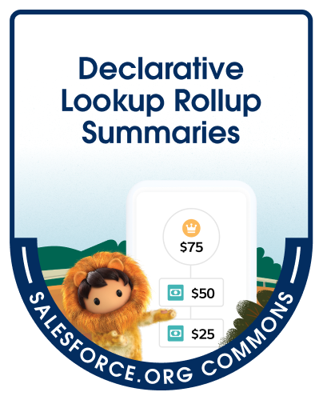

# DLRS Documentation



## Description

This repo holds the pages for public documentation. Unless you are here to edit the pages, you want to go to the [lovely Pages](https://sfdo-community-sprints.github.io/DLRS-Documentation/) view instead of this repo directly.

## License

See this repository [License](https://github.com/SFDO-Community-Sprints/DLRS-Documentation/blob/main/LICENSE).

## Local Contributor Setup

### Drafting website edits
The live site is built and deployed by GitHub Pages automatically when updates are pushed to the main branch of the public repo.

Contributors can suggest edits by downloading a local copy of the repo, making changes on a git branch,
and pushing the edited branch for review as a PR.

### Previewing website edits:

The steps below are not required to edit the site, but are helpful if you want to preview draft changes.
By using the same Just the Docs theme as the site (and the Ruby environment the theme runs on), you can build a local copy of the site that runs only on your machine.

The repo commits `Gemfile`, `Gemfile.lock`, and `.ruby-version` to pin the dependencies for running a local preview. (The live site does not depend on them.)

Starting with a local copy of the documentation repo open as a project in VS Code (or another IDE tool),
here are the steps for setting up site previewing:

**1. Install rbenv**, which manages Ruby versions used in project directories.
This will allow you to control the Ruby environment being used when working with your local copy of the website repo.

macOS:
```bash
brew install rbenv
```

Other platforms:
See https://github.com/rbenv/rbenv#installation

Note: rbenv doesn't run on Windows, so if you're working on a Windows machine, you'll need to use a Linux-based terminal shell. Install [WSL2](https://learn.microsoft.com/windows/wsl/install) with the default Ubuntu Linux version and you should be able to follow the setup steps provided here.

**2. Set up your terminal to use rbenv.** Installing rbenv doesn't switch your shell over to it automatically:

```bash
rbenv init
```

`rbenv init` detects your terminal shell and adds the necessary line to its configuration file (`~/.zshrc` on macOS).
Without this step, rbenv installs Ruby but your shell keeps using the system one and ignores
`.ruby-version`.

Note: you'll need to restart your terminal for the change to go into effect.

**3. Install the pinned Ruby version.** Run `rbenv install` with no version argument and it will read the
repo's `.ruby-version` file (currently 3.3.9) to get the version this project expects:

```bash
rbenv install
```

Check it worked with `ruby -v` — you should see 3.3.9, not the system Ruby.

**4. Install the pinned Ruby gems** needed by the Just the Docs website theme:

```bash
bundle config set path 'vendor/bundle'
bundle install
```

Notes:
- Bundler should be included with the version of Ruby installed in the previous step.
- 'vendor/bundle' will be created as a new folder (excluded from git tracking since the files in it are
part of your local testing environment)
- If a gem fails to compile during `bundle install`, you're missing a C toolchain. On macOS run
`xcode-select --install`; on Debian/Ubuntu (including WSL) install `build-essential` and `ruby-dev`. Most gems here
arrive prebuilt, so this affects only a handful of them.

**5. Serve a site preview locally** (matches how GitHub Pages builds it):

```bash
bundle exec jekyll serve --safe --source docs --baseurl="/DLRS-Documentation"
```

What each part does:
- `bundle exec` — runs Jekyll with the gems pinned in `Gemfile.lock`, rather than any other Ruby
  tooling that happens to be on your machine.
- `--safe` — turns off custom Ruby plugins and ignores symlinked files, which is what GitHub's build
  does too. Without it, you could add something that works in your preview but would be disabled on the live site.
- `--source docs` — the site's files live in `docs/`, which is also the folder GitHub Pages builds
  from.
- `--baseurl="/DLRS-Documentation"` — the published site sits under that path rather than at a domain
  root. GitHub fills this in automatically; locally you supply it so links and images resolve the
  same way they will once published.

Then open `http://localhost:4000/DLRS-Documentation/` in your browser. Jekyll rebuilds automatically as you edit.


