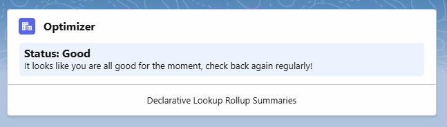
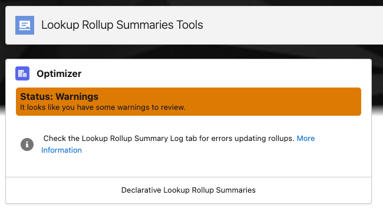
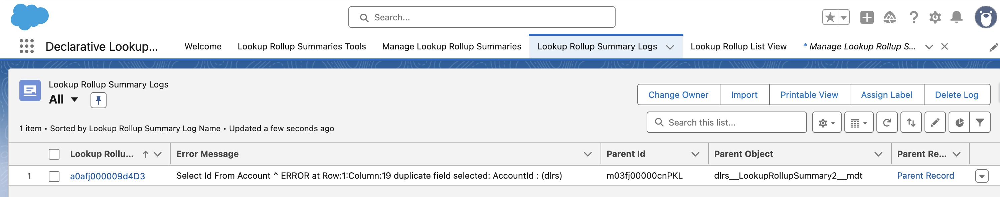
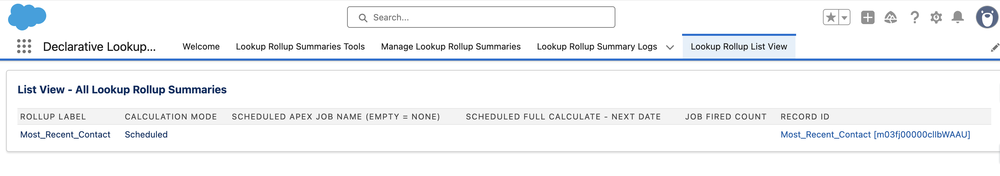

# Inheriting an Existing DLRS configuration  
When inheriting a Salesforce org that has DLRS installed it can be hard to know where to start. There are a few things that are important to understand, and we have a checklist you can follow to get you started auditing the existing setup.

If you haven’t already, we recommend you start by reading the [DLRS overview](https://sfdo-community-sprints.github.io/DLRS-Documentation/). That will help you understand what DLRS is and why someone may have installed it. To get support with any issues you encounter with DLRS you should join the [DLRS Community Group](https://trailhead.salesforce.com/trailblazer-community/groups/0F9300000009O5pCAE).

## Initial checklist
This checklist is intended to help you audit the existing setup, understand what is in place, and identify issues that you may need to address.

1. **Check your installed version.**
    * Go Installed Packages in Salesforce setup and confirm you have DLRS installed. If you do, it is listed as “Declarative Lookup Rollup Summaries Tool”. There are other rollup engines that can get confused with DLRS.
        * If you find that you have additional rollup engines, like Rollup Helper or Apex Rollups, you will want to audit all three tools and select one to consolidate into. Obviously, we recommend selecting DLRS, but please select the tool that’s best for your org.
    * Make sure you have the most current version of DLRS
        * The [installation page](https://sfdo-community-sprints.github.io/DLRS-Documentation/Installation/) lists the current version. If it is not a recent release consider [upgrading](https://sfdo-community-sprints.github.io/DLRS-Documentation/Installation/upgrade.html) (test in a sandbox first). This is particularly important if you have a version that is before 2.21.
          

2. **Check that you are assigned the appropriate permissions.** DLRS provides two permission sets, one that allows users to see and run configuration, and one that grants full admin access, including the ability to edit and delete rollup definitions. Most admins will want the latter. 
    * As needed, assign the appropriate [permission sets](https://sfdo-community-sprints.github.io/DLRS-Documentation/Installation/#assigning-permission-set ) to your users:
        * **Lookup Rollup Summaries - Process Rollups**: access to view DLRS settings and manually run rollups
        * **Lookup Rollup Summaries - Configure Rollups**: full access to DLRS settings
          

3. **Navigate to the Declarative Lookup Rollup Summaries app.** This app will include the Manage Lookup Rollup Summaries item or tab.
    * Look at the Lookup Rollup Summaries Tools tab.  
        * You may see an all-clear message like this:
        * Or, if DLRS has detected an issue, you may see a warning message:

    * If you see “Status: Warnings” you may view the warnings in the Lookup Rollup Summary Logs tab. (Look at the All list view to check for recent errors). [See here](https://sfdo-community-sprints.github.io/DLRS-Documentation/Issues/#why-did-i-receive-a-warning-that-lookup-rollup-summary-logs-exist) for more details.

    * Look at the Lookup Rollup List View tab. Review this list to see what rollups have been configured and what their status is. You will want to review each rollup, the objects and fields involved, and its calculation mode.
      

4. **Check to see if your org uses legacy configurations.** DLRS has had two different configuration systems, the current one which uses Custom Metadata, and a deprecated legacy system that stored rollup definitions using a custom object. The legacy configuration is not deployed by default but is sometimes in use, particularly on older orgs. From the App switcher search for "Lookup Rollup Summaries" (the tab for the depecated custom object), and see if any records are listed under the All list view.
  

5. **Replace any scheduled jobs owned by inactive users**. DLRS uses scheduled jobs for some rollups. All scheduled jobs in Salesforce are run by a specific user. If that user is disabled, the jobs will stop running. It is very common when inheriting a new org to find that a previous admin’s user was disabled and their scheduled jobs all suddenly stop. 
There are two types of scheduled jobs you may need to fix:
    * **Scheduled full recalculation jobs**:
        * Check for these by going to the "Lookup Rollup List View" tab in the DLRS app. The "Scheduled Apex Job Name" column will show which rollups have recalculation jobs.
        * Go to Jobs/Scheduled Jobs in setup. Here you'll be able to see more details, and importantly, whether any jobs are owned by inactive users. (To find the right jobs, it may be helpful to create a new view that filters for jobs that start with "rollup_").
        * To fix jobs with inactive users: you'll need to delete the old job from the Scheduled Jobs page in setup, then [schedule a new recalculation job](https://sfdo-community-sprints.github.io/DLRS-Documentation/User%20Guide/scheduling_rollups_v2_21.html) from the associated rollup's page in the DLRS app.
    * **RollupJob schedules**:
        * A different type of scheduled job (using the RollupJob apex class) handles recalculations for all rollups using the "Watch for Changes and Process Later" calculation mode.
        * To check for RollupJob schedules, go to "Manage Lookup Rollup Summaries (Beta)" and select the "Manage Rollup Job" button.
        * You'll also need to check the Scheduled Jobs page in setup to see whether any RollupJob schedules are owned by an inactive user (filtering for "RollupJob" in the job name can help).
        * To fix jobs with inactive users: return to the "Manage Rollup Job" button in the DLRS app. You'll be able to delete the old jobs and create new ones from here.
          

6. **Review your flows.** DLRS calculations are most commonly initiated by Triggers or Scheduled jobs - both of which are displayed in the current DLRS interface. However, since Flows can be used to trigger DLRS calculations, you should also review your active Flows to see if any call DLRS rollups.

## Frequently Asked Questions

### What is DLRS actually doing in my organization?
DLRS provides summary calculations across lookups – which Salesforce’s native rollup fields cannot do. It runs those calculations on a schedule that you define. Follow the audit process above to see what rollups are already configured. Each of those rollups follows the same general process. 

During a calculation run DLRS will:
* Pull records that meet your criteria.
* Performs the requested calculation on the data in a specific field on those records.
* Populates a field on the parent record with the value from that calculation.

You may find it useful to read the complete description of [when and how DLRS handles calculations](https://sfdo-community-sprints.github.io/DLRS-Documentation/Architecture/calculates.html). 

### What can happen if I don’t maintain DLRS?
Like any tool automation DLRS needs to be checked from time to time for errors. If you do not, there are a few potential side effects.
* Error and warning messages will continue to generate, and alert emails may go out.
* Result fields may have inaccurate data, or no data.
* Resources used to calculate rollups may affect other jobs and automations in your system.
 

**Special thanks to the DLRS team at the January 2026 Virtual Sprint for contributing to this page**
- Aaron Crossman
- Kyle Sebastian
- Erica Wong 
- Leah Meyers
- Caitlyn Duer
- Kyle Broeckel
