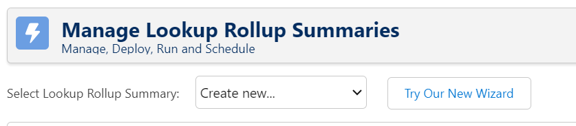

# Packaged Release History

## Release Version 2.22

### What's changed in v2.22?
Release 2.22 was basically an API update to stay inline with Salesforce's latest release.

## Release Version 2.21

### What's changed in v2.21?
Release 2.21 introduces a new Wizard User Interface (UI) built in Lightning Web Components as well as the ability to schedule the rollup job directly in the wizard. There are no underlying processing engine updates. 

We are releasing the new Wizard in “Beta” at this time which means that it will not automatically become your default UI in this release. This allows you to try out the new Wizard and still be able to switch back to the old version as needed. 

A few highlights of the new Wizard are: 
* List view of rollups that is sortable and searchable 
* Popup modal to edit the rollup when you click on the name from the List View
* Updated field order and fields labels in the Wizard to optimize and clarify the creation of rollups
* Path at the top of the rollup that displays the deployment steps needed based on the calculation mode of the rollup 
* Updated calculation mode labels (link to updated calculation mode documentation coming soon) 
* Schedule rollup job user interface that allows you to schedule any number of rollup jobs at whatever interval is needed in your instance 

### What do I need to do?
Once installed there are 2 ways to access the new wizard.
1. In the Manage Lookup Rollup Summaries page, click on the "Try Our New Wizard" Button (as long as you are on a version that starts with a 2) 
   
2. In the App Launcher, search for Beta and select Manage Lookup Rollup Summaries (Beta) 
   

### Documentation
See a full walk through of the new Wizard on the [new Getting Started for version 2.21 page](https://sfdo-community-sprints.github.io/DLRS-Documentation/User%20Guide/getting_started_v2_21.html) 
For deploying and scheduling see the [Deploying and Scheduling Rollups for version 2.21 page](https://sfdo-community-sprints.github.io/DLRS-Documentation/User%20Guide/scheduling_rollups_v2_21.html)

### Contributors
Thank you to the team who has worked for months on this new Wizard, especially **Anthony Heber** for leading the development effort for the redesign of the Wizard. 
* Jim Bartek
* Aaron George 
* Scott Fenton 
* Brad Dins (special shout out for writing the Getting Started documentation for the new Wizard) 
* Amanda Styles (for writng instructions on how to move from version 1 - Custom Object to version 2 - Custom Metadata) 
* Shari Carlson
* Nick Lindberg 
* Michael Kolodner

And the testing team at the NYC April 24 Sprint 
* Ezra LaFleur
* Tania Ortiz-Ashby
* Jill Goldenberg
* Aaron Crossman
* Amanda Styles 
* Bryan Graves 
* Michael Kolodner
* Alexander Lapa 
* Emilie Mayoden
* Shari Carlson
* Jacky Nolan

### Pull Requests/GutHub Issues Resolved in this Release

**Critical Changes**
* Change use a wrapper class to communicate with the LWCs, enabling the LWCs to be mostly namespace agnostic. [PR1441](https://github.com/SFDO-Community/declarative-lookup-rollup-summaries/pull/1441)
* Change to not directly import PE object and fields. They are corrupted by the platform. Instead import another object and use that to discover the namespace, if present. [PR1442](https://github.com/SFDO-Community/declarative-lookup-rollup-summaries/pull/1442)
* Improve record interaction flows with by re-opening after record save. [PR1446](https://github.com/SFDO-Community/declarative-lookup-rollup-summaries/pull/1446)
* Change cronstrue lib to load as part of the component instead of from Static Resources [PR1451](https://github.com/SFDO-Community/declarative-lookup-rollup-summaries/pull/1451)
* LWC Wizard not correctly display next scheduled full calculation [PR1468](https://github.com/SFDO-Community/declarative-lookup-rollup-summaries/pull/1468)
* LWC Wizard overwrites record for duplicated API Name [PR1468](https://github.com/SFDO-Community/declarative-lookup-rollup-summaries/pull/1468)

**Changes**
* Also added loading spinner and cleaned up prop usage. [PR1451](https://github.com/SFDO-Community/declarative-lookup-rollup-summaries/pull/1451)
* Move toast handling out of modal and add error capture [PR1453](https://github.com/SFDO-Community/declarative-lookup-rollup-summaries/pull/1453)
* Add Apex tests for code added to support the new LWC Wizard [PR1454](https://github.com/SFDO-Community/declarative-lookup-rollup-summaries/pull/1454)
* Update OSS Credits for pre-existing software [PR1455](https://github.com/SFDO-Community/declarative-lookup-rollup-summaries/pull/1455)
* Label and API Name should be limited to 40 characters and block save on error [PR1468](https://github.com/SFDO-Community/declarative-lookup-rollup-summaries/pull/1468)
* Clarify messaging for Outstanding Scheduled Items [PR1468](https://github.com/SFDO-Community/declarative-lookup-rollup-summaries/pull/1468)
* Fix typos [PR1468](https://github.com/SFDO-Community/declarative-lookup-rollup-summaries/pull/1468)
* Edit screen shouldn't use collapsible sections except for Advanced [PR1468](https://github.com/SFDO-Community/declarative-lookup-rollup-summaries/pull/1468)
* Path should reserve space to limit UI shift [PR1468](https://github.com/SFDO-Community/declarative-lookup-rollup-summaries/pull/1468)
* Schedule Wizard: Improve title and Tagline [PR1468](https://github.com/SFDO-Community/declarative-lookup-rollup-summaries/pull/1468)
* Schedule Wizard: Manage error states for poorly configured custom and for Schedule Items at max for org [PR1468](https://github.com/SFDO-Community/declarative-lookup-rollup-summaries/pull/1468)
* If deployment fails, editor modal should be restored to edited state [PR1468](https://github.com/SFDO-Community/declarative-lookup-rollup-summaries/pull/1468)

## Release Version 2.20
**What's changed in v2.20?**
This was an API update so that recently released objects (specifically in Nonprofit Cloud) are accessbile in DLRS. 

## Release Version 2.19
Release 2.19 is mostly a technical update with little to no changes in the User Interface. The one major change that people were watching for is that DLRS is now hyperforce ready with the removal of the reference to NA1 in a couple of URLs [[PR1358]](https://github.com/SFDO-Community/declarative-lookup-rollup-summaries/pull/1358). The other critical change of note is a performance enhancement in how Rollup Configs are retrieved to keep SOQL counts low [[PR1360]](https://github.com/SFDO-Community/declarative-lookup-rollup-summaries/pull/1360). 

**What do I need to do?**  
To get the new version, you only need to [install version 2.19 of the package](https://install.salesforce.org/products/dlrs/latest). There are no other steps you need to take to have access to the updates in this release.

**What’s changed in v2.19?**  
Below is a full list of changes. To see detailed information, click on the pull request (PR) number at the end of the item.

### Critical Changes
* Update a couple urls that reference na1 for hyperforce migration. [[PR1358]](https://github.com/SFDO-Community/declarative-lookup-rollup-summaries/pull/1358)
* Huge changes to how Rollup Configs are retrieved. Primarily to keep SOQL counts low in the event of recursion or chained rollups where one rollup update may cascade into another rollup. Not a big issue for most people but we do get reports of DLRS running over it's query limits from time to time. [[PR1360]](https://github.com/SFDO-Community/declarative-lookup-rollup-summaries/pull/1360) This is a high risk change because this impacts nearly every aspect of the application. Will need extra QA on this including UI-based testing because this powers the config editing interfaces as well as the rollup engine. [[PR1360]](https://github.com/SFDO-Community/declarative-lookup-rollup-summaries/pull/1360)
* Resolve test guards that should have been blocked but were seeing the packaged triggers and running. [[PR1365]](https://github.com/SFDO-Community/declarative-lookup-rollup-summaries/pull/1365)
* Add direct test coverage for trigger [[PR1366]](https://github.com/SFDO-Community/declarative-lookup-rollup-summaries/pull/1366)

### Changes
* Closing some ambiguity in how field validation is handled. [[PR1331]](https://github.com/SFDO-Community/declarative-lookup-rollup-summaries/pull/1331)
* Bypassing some fflib "help" that causes relationship names to resolve to fields. [[PR1331]](https://github.com/SFDO-Community/declarative-lookup-rollup-summaries/pull/1331)
* Adding in more tests focused on using CMDTs as well as exercising more validation logic. [[PR1331]](https://github.com/SFDO-Community/declarative-lookup-rollup-summaries/pull/1331)
* Enable installing DLRS in orgs with encrypted fields [[PR1345]](https://github.com/SFDO-Community/declarative-lookup-rollup-summaries/pull/1345)
* Update metadata API version as well as the lagging API version used to interface with the Metadata API (RollupController) [[PR1362]](https://github.com/SFDO-Community/declarative-lookup-rollup-summaries/pull/1362)
* Cleaned up one file and added standard guards to two others that were missing them. [[PR1365]](https://github.com/SFDO-Community/declarative-lookup-rollup-summaries/pull/1365)
* Update RollupController (which backs the Trigger Deployment VF page) so it can auto-determine the max supported API version for the current org. This breaks a dependency we have on manually updating the package each release to support new objects. [[PR1374]](https://github.com/SFDO-Community/declarative-lookup-rollup-summaries/pull/1374)
* fixed faulty file ending for custom metadata [[PR1376]](https://github.com/SFDO-Community/declarative-lookup-rollup-summaries/pull/1376)

### QE 
* added more QE config data, i.e. [[PR1372]](https://github.com/SFDO-Community/declarative-lookup-rollup-summaries/pull/1372)
* QE App, Record Pages, Permset, tiny Apex Helper [[PR1372]](https://github.com/SFDO-Community/declarative-lookup-rollup-summaries/pull/1372)
* clones of LookUpChild__c and LookupParent__c to avoid dependencies of QA work on package internals [[PR1372]](https://github.com/SFDO-Community/declarative-lookup-rollup-summaries/pull/1372)
* adjusted cumulusci.yml [[PR1372]](https://github.com/SFDO-Community/declarative-lookup-rollup-summaries/pull/1372)

### Housekeeping
* updated .forceignore ON PULL for files we don't care about or cannot / should not package [[PR1372]](https://github.com/SFDO-Community/declarative-lookup-rollup-summaries/pull/1372)
* updated default folder structure so that pulling with dx doesn't create additional folders anymore [[PR1372]](https://github.com/SFDO-Community/declarative-lookup-rollup-summaries/pull/1372)
* removed unnecessary files [[PR1372]](https://github.com/SFDO-Community/declarative-lookup-rollup-summaries/pull/1372)

## Code Contributors
* Scott Fenton
* David Reed
* Christian Szandor Knapp
* Anthony Heber
* Jim Bartek

## Version 2.18

Install DLRS 2.18 into your production, sandbox, or scratch org via [Salesforce.org MetaDeploy](https://install.salesforce.org/products/dlrs/latest).

In Release 2.18, you will find several small updates and fixes, some underlying technical and security updates, a widget to notify admins of scheduled items that need attention, and an update that will reduce performance-based problems like record lock and CPU timeout errors.

You only need to install version 2.18 of the package. There are no other steps you need to take to have access to the updates in this release. 

**Features**

* Rollups will now only execute DML if it would change the parent's value. (Issue #[1269](https://github.com/SFDO-Community/declarative-lookup-rollup-summaries/issues/1269), #[340](https://github.com/SFDO-Community/declarative-lookup-rollup-summaries/issues/340))
  * When a child record is modified and that modification is a field that triggers a rollup calculation, DLRS will execute the aggregate query then query the parent to ensure the DML is necessary. Any parent already holding the correct values will be excluded from the DML. 
  * This will significantly reduce record lock, CPU Timeout and other performance-based problems. 
  * This feature will be enabled automatically, but you can disable it by navigating to Custom Settings in Setup.
    * Click on Manage in front of the Declarative Lookup Rollup Summaries setting. 
    * Click on Edit. 
    * Check the box “Disable Parent DML Check”. Click on Save

    

* Added a widget to the Lookup Rollup Summaries Tool to notify DLRS admins that the Scheduled Items are building up and either need to be scheduled or deleted. This updated widget can be found on the Lookup Rollup Summaries Tool tab. (Issue #[1271](https://github.com/SFDO-Community/declarative-lookup-rollup-summaries/issues/1271), #[735](https://github.com/SFDO-Community/declarative-lookup-rollup-summaries/issues/735), #[566](https://github.com/SFDO-Community/declarative-lookup-rollup-summaries/issues/566)) 
* In the wizard, the following fields were updated: (Issue #[1236](https://github.com/SFDO-Community/declarative-lookup-rollup-summaries/issues/1236))
  * Lookup Rollup Summary name changed to Lookup Rollup Summary Label
  * Unique Name changed to Lookup Rollup Summary API Name
  * Lookup Rollup Summary Label and Lookup Rollup Summary API name are both limited to 40 characters to avoid error on save. 
  * Lookup Rollup Summary API Name is auto-populated from Lookup Rollup Summary Label field. 
* Updated scheduled error email subject to match real time email subject (includes Org Id and Name). (Issue #[1219](https://github.com/SFDO-Community/declarative-lookup-rollup-summaries/issues/1219))
* Updated package API version to v57.0. There should be no impact to users. (Issue #[1294](https://github.com/SFDO-Community/declarative-lookup-rollup-summaries/issues/1294))
* Several test trigger, security, and packaging updates. These are necessary technical updates to allow for the packaging of the release. There should be no impact to users.

**Fixes**
* Corrected Lookup Rollup List View: Maximum view state size limit error. The error was corrected by filtering out Deleted Cron Triggers in the selectAll query. (Issue #[1253](https://github.com/SFDO-Community/declarative-lookup-rollup-summaries/issues/1253))
* Updated ReadMe and Wiki to remove outdated information, including that all documentation and installation instructions can now be found on the [Documentation website](https://sfdo-community-sprints.github.io/DLRS-Documentation/). 
* Updated link to documentation on the Welcome page (Issue #[1235](https://github.com/SFDO-Community/declarative-lookup-rollup-summaries/issues/1235))

**Code Contributors**
* Scott Fenton
* David Reed
* Christian Szandor Knapp
* Anthony Heber
* Ezra LaFleur
* Jim Bartek

 

## Version 2.17

- Feature - [New creation wizard: Custom UI for creation of Lookup Rollup Summaries](https://github.com/SFDO-Community/declarative-lookup-rollup-summaries/pull/1113).
- Feature - [List view for Rollup records within lightning app: Shows all rollups including information to quickly see if a rollup is scheduled and the schedule date](https://github.com/SFDO-Community/declarative-lookup-rollup-summaries/issues/1131).
- Feature - [Detect NPSP/TDTM during deployment of DLRS test code. No configuration required. We disable TDTM triggers during the deployment of DLRS test code](https://github.com/SFDO-Community/declarative-lookup-rollup-summaries/pull/1171).
- Performance - [Reduced number of SOQL queries made by using custom metadata methods for Rollup Summaries Selector](https://github.com/SFDO-Community/declarative-lookup-rollup-summaries/issues/1049).
- Enhancement - [Added `Clone` Button on main Rollup creation page to quickly copy lookup rollup summaries](https://github.com/SFDO-Community/declarative-lookup-rollup-summaries/issues/1121).
- Enhancement - [Added `Schedule` Full Calculate field to rollup creation page – Adds ability to track next scheduled full calculate on rollup](https://github.com/SFDO-Community/declarative-lookup-rollup-summaries/issues/1126).
- Enhancement - [Added error and informational messages to guide user through rollup activation](https://github.com/SFDO-Community/declarative-lookup-rollup-summaries/issues/1123).
- Enhancement - [Added ability to sort fields by label instead of API name in New Wizard](https://github.com/SFDO-Community/declarative-lookup-rollup-summaries/issues/1130).
- Bug - [Fixed issue preventing scheduled rollups from working if different child objects and the same parent object](https://github.com/SFDO-Community/declarative-lookup-rollup-summaries/issues/802).
- Bug - [Fixed broken image link on app homepage](https://github.com/SFDO-Community/declarative-lookup-rollup-summaries/issues/1170).
- Bug - [Fixed missing namespace in trigger test code](https://github.com/SFDO-Community/declarative-lookup-rollup-summaries/pull/1177).
- Bug - [Add global access modifier for NPSP](https://github.com/SFDO-Community/declarative-lookup-rollup-summaries/pull/1180).
- Bug - [New Wizard throwing error if picklist exceeds 1000 objects](https://github.com/SFDO-Community/declarative-lookup-rollup-summaries/pull/1223)

  
## Version 2.16

- Internal release

  
## Release Version 2.15

Install DLRS 2.15 into your production, sandbox, or scratch org via [Salesforce.org MetaDeploy](https://install.salesforce.org/products/dlrs/latest).

  
## Version 2.14

Package [Production URL](https://login.salesforce.com/packaging/installPackage.apexp?p0=04t5p000000eegF&isdtp=p1), [Sandbox URL](https://test.salesforce.com/packaging/installPackage.apexp?p0=04t5p000000eegF&isdtp=p1)

- Enhancement - Moved to API 51.0

  
## Release Version 2.13

Package [Production URL](https://login.salesforce.com/packaging/installPackage.apexp?p0=04t0N000000YGN9&isdtp=p1), [Sandbox URL](https://test.salesforce.com/packaging/installPackage.apexp?p0=04t0N000000YGN9&isdtp=p1)

- Enhancement - Moved to API 50.0
- Enhancement - Fixed Remote Site would incorrectly show as created and enhanced the whole Welcome tab
- Enhancement - Added new [Wiki page](https://github.com/afawcett/declarative-lookup-rollup-summaries/wiki/Metadata-API-Connection-Issues-FAQ), linked from Welcome tab relating to various requirements and gotcha's on Metadata API connection issues
- Bug - Optimizer tab would not show correctly if the user was not an Admin - now works for any user so long as they are assigned the Lookup Rollup Summary Configure permission set.

  
## Release Version 2.12

Package [Production URL](https://login.salesforce.com/packaging/installPackage.apexp?p0=04t0N000000YGN4&isdtp=p1), [Sandbox URL](https://test.salesforce.com/packaging/installPackage.apexp?p0=04t0N000000YGN4&isdtp=p1)

- Enhancement - [Avoid need for Remote Site setup](https://github.com/afawcett/declarative-lookup-rollup-summaries/issues/925)
- Enhancement - [Cannot disable DLRS in Apex](https://github.com/afawcett/declarative-lookup-rollup-summaries/issues/889)
- Enhancement - [Update API version of DLRS](https://github.com/afawcett/declarative-lookup-rollup-summaries/issues/831)
- Enhancement - [New "Lookup Rollup Summaries Tools" tab](https://github.com/afawcett/declarative-lookup-rollup-summaries/issues/678)
- Enhancement - [Improved UI messaging to direct users to the Manage Lookup Rollup Summaries tab](https://github.com/afawcett/declarative-lookup-rollup-summaries/issues/677)
- Enhancement - [Minor tweaks to the messaging on the full recalc UI's](https://github.com/afawcett/declarative-lookup-rollup-summaries/issues/675)
- Enhancement - [Route various apex job errors to scheduling/running users email](https://github.com/afawcett/declarative-lookup-rollup-summaries/issues/671)
- Enhancement - [Modify test code for parent object](https://github.com/afawcett/declarative-lookup-rollup-summaries/issues/637)
- Enhancement - [Avoid Shadow Custom Object Based Rollup Records - Total DLRS Newbie frustration](https://github.com/afawcett/declarative-lookup-rollup-summaries/issues/618)
- Bug - [Master branch has Apex Unit test failures](https://github.com/afawcett/declarative-lookup-rollup-summaries/issues/894)
- Bug - [Clicking Cancel on Full Calculate schedule page goes back to wrong page](https://github.com/afawcett/declarative-lookup-rollup-summaries/issues/676)

Also see [Declarative Rollup Summary Tool Update for v2.12](https://andyinthecloud.com/2020/04/05/declarative-rollup-summary-tool-update/).

  
## Release Version 2.11.1

Package [Production URL](https://login.salesforce.com/packaging/installPackage.apexp?p0=04t0N000001E2L5), [Sandbox URL](https://test.salesforce.com/packaging/installPackage.apexp?p0=04t0N000001E2L5)

- Bug [Summer 19-Invalid field MasterRecordId for Case SobjectException due version 42](https://github.com/afawcett/declarative-lookup-rollup-summaries/issues/818)

**IMPORTANT NOTE:**
The Cases DLRS Trigger will fail in Summer '19 if you do not upgrade to 2.11.1 until the related known issue is fixed by Salesforce. This only impacts users with the Case object DLRS Child Trigger created and active.

  
## Release Version 2.11

Package [Production URL](https://login.salesforce.com/packaging/installPackage.apexp?p0=04t0N000000IyYr), [Sandbox URL](https://test.salesforce.com/packaging/installPackage.apexp?p0=04t0N000000IyYr)

- Enhancement [OR clause in top level filter breaks SOQL query](https://github.com/afawcett/declarative-lookup-rollup-summaries/issues/631)
- Enhancement [Upgrade to Latest API: New object are not available](https://github.com/afawcett/declarative-lookup-rollup-summaries/issues/627)
- Bug [SObject type does not allow locking rows](https://github.com/afawcett/declarative-lookup-rollup-summaries/issues/619)
- Enhancement [Remote Settings update](https://github.com/afawcett/declarative-lookup-rollup-summaries/issues/372)
- Enhancement [Lightning Enterprise Edition](https://github.com/afawcett/declarative-lookup-rollup-summaries/issues/569)

  
## Release Version 2.10

Package [Production URL](https://login.salesforce.com/packaging/installPackage.apexp?p0=04tb0000000UvwL), [Sandbox URL](https://test.salesforce.com/packaging/installPackage.apexp?p0=04tb0000000UvwL)

- Enhancement [Enhancement: Schedule calculate - don't DML update record if rollup value unchanged](https://github.com/afawcett/declarative-lookup-rollup-summaries/issues/547)
- Enhancement [Known ordering for RollupCalculateJob records](https://github.com/afawcett/declarative-lookup-rollup-summaries/issues/518)
- Enhancement [Can't aggregate Salesforce Files (ContentDocumentLink) as child object](https://github.com/afawcett/declarative-lookup-rollup-summaries/issues/433)
- Enhancement [Reinstate support for Test Code field on Rollups using Custom Metadata](https://github.com/afawcett/declarative-lookup-rollup-summaries/issues/304)
- Bug [Error When Adding a Note in SF Lightning Due to DLRS Trigger](https://github.com/afawcett/declarative-lookup-rollup-summaries/issues/558)
- Bug [Calculate new roll up failing on "The rollup must be Active before you can run a Calculate job"](https://github.com/afawcett/declarative-lookup-rollup-summaries/issues/511)

**UPGRADE NOTE:** If you access the Rollup definitions via the standard Salesforce Custom Metadata UI under the Setup menu. Make sure to remove 'Test Code (Deprecated)' (small one) from the layout and add the new 'Test Code' field (large one). If you only ever use the Manage Rollup Summaries tab you do not need to worry about this. Also note that any test code placed in the original smaller field will be automatically migrated to the new field on next edit (via Manage Rollup Summaries tab).

  
## Release Version 2.9

Package [Production URL](https://login.salesforce.com/packaging/installPackage.apexp?p0=04tb0000000MXnE), [Sandbox URL](https://test.salesforce.com/packaging/installPackage.apexp?p0=04tb0000000MXnE)

- Enhancement [Support API 37.0 onwards objects. Update RollupController.cls to remove hard-coded API version references](https://github.com/afawcett/declarative-lookup-rollup-summaries/issues/505)
- Enhancement [Update to new fflib and optimised selector code](https://github.com/afawcett/declarative-lookup-rollup-summaries/issues/476)
- Enhancement [Enhancement - Button on the Summary Logs List View for deleting Logs](https://github.com/afawcett/declarative-lookup-rollup-summaries/issues/474)
- Enhancement [Support for Currency Roll Ups with Community Portal Users](https://github.com/afawcett/declarative-lookup-rollup-summaries/issues/454)
- Enhancement [Improve error message Lookup Rollup Summary 'X' is invalid, your org configuration may have changed](https://github.com/afawcett/declarative-lookup-rollup-summaries/issues/377)
- Bug [Support WorkOrder. Deploy Trigger. Entity is not API accessible.](https://github.com/afawcett/declarative-lookup-rollup-summaries/issues/481)
- Bug [Support AccountContactRelation. Deploy Trigger. Entity is not api accessible](https://github.com/afawcett/declarative-lookup-rollup-summaries/issues/438)
- Bug [RollupServiceTestTrigger, RollupServiceTest4Trigger and RollupServiceTest5Trigger has not been deployed](https://github.com/afawcett/declarative-lookup-rollup-summaries/issues/365)
- Bug [Support CaseComment Rollups, Cannot locate Apex Type for ID CaseComment](https://github.com/afawcett/declarative-lookup-rollup-summaries/issues/17)

**IMPORTANT NOTES:**

- Please check your Rollup Calculate Job records and if needed (no jobs are actually running) delete them.
- There is a new Delete Log button on the Summary Logs List View layout please add it

  
## Release Version 2.8

Package [Production URL](https://login.salesforce.com/packaging/installPackage.apexp?p0=04tb0000000MXkF), [Sandbox URL](https://test.salesforce.com/packaging/installPackage.apexp?p0=04tb0000000MXkF)

- Bug [Lookup Rollup Calculate Job records are not being deleted even after the Calculate Job finishes](https://github.com/afawcett/declarative-lookup-rollup-summaries/issues/460)
- Bug [Help Text for Calculation Mode needs updating](https://github.com/afawcett/declarative-lookup-rollup-summaries/issues/350)
- Bug [Account Trigger->Decimal to Integer Illegal Assignment](https://github.com/afawcett/declarative-lookup-rollup-summaries/issues/326)
- Enhancement [Feature Request - the ability to set schedule dlrs job name](https://github.com/afawcett/declarative-lookup-rollup-summaries/issues/415)
- Enhancement [Better messaging when scheduling jobs](https://github.com/afawcett/declarative-lookup-rollup-summaries/issues/353)

**IMPORTANT NOTE:** Please check your Rollup Calculate Job records and if needed delete them.

  
## Release Version 2.7

Package [Production URL](https://login.salesforce.com/packaging/installPackage.apexp?p0=04tb0000000MXk5), [Sandbox URL](https://test.salesforce.com/packaging/installPackage.apexp?p0=04tb0000000MXk5)

- Bug [Validation Errors 'ENTITY_IS_DELETED' While Saving when Parent gets Deleted As Well](https://github.com/afawcett/declarative-lookup-rollup-summaries/issues/39)

  
## Release Version 2.6

Package [Production URL](https://login.salesforce.com/packaging/installPackage.apexp?p0=04tb0000000MXZG), [Sandbox URL](https://test.salesforce.com/packaging/installPackage.apexp?p0=04tb0000000MXZG)

- Bug [DLRS fails rollup on Checkbox when no records found](https://github.com/afawcett/declarative-lookup-rollup-summaries/issues/379) Thanks Wes Weingartner!
- Bug [Developer Script Exception : Entity is not api accessible](https://github.com/afawcett/declarative-lookup-rollup-summaries/issues/360)
- Bug [Lookup Rollup Calculate Jobs not Case-sensitive](https://github.com/afawcett/declarative-lookup-rollup-summaries/issues/347)

  
## Release Version 2.5

Package [Production URL](https://login.salesforce.com/packaging/installPackage.apexp?p0=04tb0000000MXVO), [Sandbox URL](https://test.salesforce.com/packaging/installPackage.apexp?p0=04tb0000000MXVO)

- Bug [After Delete trigger for merging fails when new dlrs added](https://github.com/afawcett/declarative-lookup-rollup-summaries/issues/371)
- Bug [Should not need to mark Active to do a manual Calculation](https://github.com/afawcett/declarative-lookup-rollup-summaries/issues/359)
- Bug [Apex Scheduler Day of Week Drop down is a day out](https://github.com/afawcett/declarative-lookup-rollup-summaries/issues/349)
- Bug [Merging lead causes Permission to create dlrs**LookupRollupSummary**c error](https://github.com/afawcett/declarative-lookup-rollup-summaries/issues/345)
- Enhancement [Support ContentNote rollups (upgraded to API 37.0)](https://github.com/afawcett/declarative-lookup-rollup-summaries/issues/351)

  
## Release Version 2.4.2

Package [Production URL](https://login.salesforce.com/packaging/installPackage.apexp?p0=04tb0000000ka9e), [Sandbox URL](https://test.salesforce.com/packaging/installPackage.apexp?p0=04tb0000000ka9e)

- Bug [Install failed 2.4 update - New dependency on LookupChild's Sharing mode in Apex Unit Test](https://github.com/afawcett/declarative-lookup-rollup-summaries/issues/344)

  
## Release Version 2.4.1

Package [Production URL](https://login.salesforce.com/packaging/installPackage.apexp?p0=04tb0000000ka90), [Sandbox URL](https://test.salesforce.com/packaging/installPackage.apexp?p0=04tb0000000ka90)

**Documentation:** See [Declarative Rollup Tool Summer (2016) Release](https://andyinthecloud.com/2016/06/19/declarative-rollup-tool-summer-release/)

- Bug [Installation Issue - The user license doesn't allow the permission: Read All dlrs**LookupRollupCalculateJob**c](https://github.com/afawcett/declarative-lookup-rollup-summaries/issues/331)
- Enhancement [Roll Up just for few number of records](https://github.com/afawcett/declarative-lookup-rollup-summaries/issues/315)
- Enhancement [Support for rollups on Account when doing Merge Account](https://github.com/afawcett/declarative-lookup-rollup-summaries/issues/303)
- Enhancement [Add support for ALL ROWS](https://github.com/afawcett/declarative-lookup-rollup-summaries/issues/267)
- Enhancement [Scheduled Calculate Custom Settings](https://github.com/afawcett/declarative-lookup-rollup-summaries/issues/265)
- Enhancement [Open Activities still associated to the Converted Lead](https://github.com/afawcett/declarative-lookup-rollup-summaries/issues/164)
- Enhancement [Remove from Lookup Rollup Summary Schedule Items when Parent is deleted](https://github.com/afawcett/declarative-lookup-rollup-summaries/issues/147)

  
## Version 2.3

Package [Production URL](https://login.salesforce.com/packaging/installPackage.apexp?p0=04tb0000000cBqJ), [Sandbox URL](https://test.salesforce.com/packaging/installPackage.apexp?p0=04tb0000000cBqJ)

- Bug [Attempt to de-reference a null object from RollupJob (as seen on Apex Jobs page)](https://github.com/afawcett/declarative-lookup-rollup-summaries/issues/318)
- Bug [SP(), BR(), TB() not working in 2.2](https://github.com/afawcett/declarative-lookup-rollup-summaries/issues/291)
- Bug [Calculation Id not populating in Version 2.1](https://github.com/afawcett/declarative-lookup-rollup-summaries/issues/280)
- Bug [Validation Errors 'ENTITY_IS_DELETED' While Saving when Parent gets Deleted As Well](https://github.com/afawcett/declarative-lookup-rollup-summaries/issues/39)

  
## Version 2.2

Package [Production URL](https://login.salesforce.com/packaging/installPackage.apexp?p0=04tb0000000cBh0), [Sandbox URL](https://test.salesforce.com/packaging/installPackage.apexp?p0=04tb0000000cBh0)

- Bug [multiple criteria fields don't work anymore.](https://github.com/afawcett/declarative-lookup-rollup-summaries/issues/281)
- Enhancement [Add support for space & tab in concat delimiter](https://github.com/afawcett/declarative-lookup-rollup-summaries/issues/278) thanks to [jondavis9898](https://github.com/afawcett/declarative-lookup-rollup-summaries/issues?q=is%3Aissue+is%3Aopen+author%3Ajondavis9898)
- Enhancement [Multiple BR() for Concatenate](https://github.com/afawcett/declarative-lookup-rollup-summaries/issues/258)

  
## Version 2.1

Package [Production URL](https://login.salesforce.com/packaging/installPackage.apexp?p0=04tb0000000cBgv), [Sandbox URL](https://test.salesforce.com/packaging/installPackage.apexp?p0=04tb0000000cBgv)

- Bug [Manage Lookup Rollup Summaries produces error CurrencyIsoCode not valid](https://github.com/afawcett/declarative-lookup-rollup-summaries/issues/273)

  
## Version 2.0

Package [Production URL](https://login.salesforce.com/packaging/installPackage.apexp?p0=04tb0000000cBgl), [Sandbox URL](https://test.salesforce.com/packaging/installPackage.apexp?p0=04tb0000000cBgl)

- Enhancement [Support for Custom Metadata](https://github.com/afawcett/declarative-lookup-rollup-summaries/issues/242) (Pilot). See [Declarative Lookup Rollup Summary Tool and Custom Metadata](http://andyinthecloud.com/2015/12/24/declarative-lookup-rollup-summary-tool-and-custom-metadata/) for more information.

**UPGRADE NOTE:** There is a new **Manage Lookup Rollup Summaries** tab to support Custom Metadata support.

**Known Current Limitations of Custom Metadata Support**

- Ability to override the generated Apex Test code is not supported (due to platform restriction)
- Aesthetic case adjustment for object field API names will not be performed, e.g. account would not change to Account
- When you Undeploy via Manage Child Triggers button, Active Custom Metadata based rollups are not automatically deactivated, please deactivate manually via un-ticking the Active checkbox.
- Advanced Rollup UI is not currently available, this will be integrated at a later date
- Description field is limited to only 255 characters (due to platform restriction)
- List View support is available under Setup, Custom Metadata Types, Manage Records but does not invoke the new UI for editing

  
## Version 1.25

Package [Production URL](https://login.salesforce.com/packaging/installPackage.apexp?p0=04tb0000000cBPs), [Sandbox URL](https://test.salesforce.com/packaging/installPackage.apexp?p0=04tb0000000cBPs)

- Enhancement [Allow First/Last Summaries to work on Id and Reference Fields](https://github.com/afawcett/declarative-lookup-rollup-summaries/issues/264) thanks to [Christian Carter](https://github.com/cdcarter).
- Enhancement [Nightly Scheduled RollupJob running, but Summaries not updating](https://github.com/afawcett/declarative-lookup-rollup-summaries/issues/142), thanks to [frontendloader](https://github.com/frontendloader).

**UPDATE NOTE:** There is a new **Schedule Calculate** button to add to the object Layout, see screenshots below.

This will show the following UI related to the enhancement above.

  
## Version 1.24

Package [Production URL](https://login.salesforce.com/packaging/installPackage.apexp?p0=04tb0000000QgPw), [Sandbox URL](https://test.salesforce.com/packaging/installPackage.apexp?p0=04tb0000000QgPw)

- Bug fix [Rollup not recalculated when order by field changes](https://github.com/afawcett/declarative-lookup-rollup-summaries/issues/240)
- Bug fix [Concatenation Rollups order maybe none Deterministic - Consider moving order by from LREngine.RollupSummaryField to LREngine.Context](https://github.com/afawcett/declarative-lookup-rollup-summaries/issues/239)
- Enhancement [Enhance Order by to allow multiple fields and specify ASC/DESC](https://github.com/afawcett/declarative-lookup-rollup-summaries/issues/216)

**IMPORTANT NOTE:** This release improves the query optimisation within the tool when there are multiple rollups. There is also a small change in behaviour from previous releases, relating to default ordering. If you have been using concat, first or last operations and have not specified explicit order by on the rollup, you must do from now on, it no longer defaults to the field to rollup. In prior releases the behaviour of this operation may or may not have been consistently working as expected, depending on the existence of one or more rollups.

  
## Version 1.23

Package [Production URL](https://login.salesforce.com/packaging/installPackage.apexp?p0=04tb0000000QgAc), [Sandbox URL](https://test.salesforce.com/packaging/installPackage.apexp?p0=04tb0000000QgAc)

- Enhancement for [Add developer API to mirror triggerHandler behavior](https://github.com/afawcett/declarative-lookup-rollup-summaries/issues/236)
- Enhancement for [Advanced Rollup API Reqiurement: Count of Child on Parent, Child Re-parent, Old Parent Count not Correct](https://github.com/afawcett/declarative-lookup-rollup-summaries/issues/167)
- Bug fix for [Reduced number of queries when object name case differs across rollups : Multiple LRE Contexts when rollup definition only differs by case](https://github.com/afawcett/declarative-lookup-rollup-summaries/issues/229)
- Bug fix for [Master records updated when related records have not changed ](https://github.com/afawcett/declarative-lookup-rollup-summaries/issues/226)
- Bug fix for [Different order by on same relationship field results in incorrect result](https://github.com/afawcett/declarative-lookup-rollup-summaries/issues/222)
- Bug fix for [Rollup Summary validations not being enforced on updates after fflib upgrade ](https://github.com/afawcett/declarative-lookup-rollup-summaries/issues/212)

  
## Version 1.22

Package [Production URL](https://login.salesforce.com/packaging/installPackage.apexp?p0=04tb0000000Qg9t), [Sandbox URL](https://test.salesforce.com/packaging/installPackage.apexp?p0=04tb0000000Qg9t)

- Enhancement for [Ability to enable SeeAllData in the generated tests](https://github.com/afawcett/declarative-lookup-rollup-summaries/issues/202)
- Bug fix for [Error with multi-currency](https://github.com/afawcett/declarative-lookup-rollup-summaries/issues/204)
- Bug fix for [Some of the new fields in the last release are not in the Manage Rollup Permission Set](https://github.com/afawcett/declarative-lookup-rollup-summaries/issues/201)

If you are upgrading, you will need to make the following changes to the Layout.

- Add **Test Code See All Data** field to the layout

  
## Version 1.21

Package [Production URL](https://login.salesforce.com/packaging/installPackage.apexp?p0=04tb0000000QfxT), [Sandbox URL](https://test.salesforce.com/packaging/installPackage.apexp?p0=04tb0000000QfxT)

- Enhancement for [Can't get Apex Trigger to Deploy in Production](https://github.com/afawcett/declarative-lookup-rollup-summaries/issues/199)
- Enhancement for [Implement the new test level features in Summer 15 to deploy triggers faster](https://github.com/afawcett/declarative-lookup-rollup-summaries/issues/190)
- Enhancement for [Allow users to edit child records without needing access to Rollup Summary object](https://github.com/afawcett/declarative-lookup-rollup-summaries/issues/162)
- Fix for [First error: Invalid Id when in Scheduled Mode](https://github.com/afawcett/declarative-lookup-rollup-summaries/issues/185)
- Fix for [Duplicate Field Selected error message](https://github.com/afawcett/declarative-lookup-rollup-summaries/issues/155)

If you are upgrading, you will need to make the following changes to the Layout.

- Add **Test Code** field to the layout

  
## Version 1.20

Package [Production URL](https://login.salesforce.com/packaging/installPackage.apexp?p0=04tb0000000QfxO), [Sandbox URL](https://test.salesforce.com/packaging/installPackage.apexp?p0=04tb0000000QfxO)

- Enhancement for [Private Objects / Sharing Rule](https://github.com/afawcett/declarative-lookup-rollup-summaries/issues/183)
- Enhancement for [Allow Master Records To Be Filtered During Calculate](https://github.com/afawcett/declarative-lookup-rollup-summaries/issues/179) thanks to [Christian G. Warden](https://github.com/cwarden)
- Fix for [Some tests have hard-coded namespace](https://github.com/afawcett/declarative-lookup-rollup-summaries/issues/175) thanks to [Christian G. Warden](https://github.com/cwarden)
- Fix for [Rollup fails when child field is Multi-select picklist and is null](https://github.com/afawcett/declarative-lookup-rollup-summaries/issues/150) thanks to [Daniel Hoechst](https://github.com/dhoechst)

If you are upgrading, you will need to make the following changes to the Layout.

- Add **Calculation Sharing Mode** field to the layout

  
## Version 1.19

Package [Production URL](https://login.salesforce.com/packaging/installPackage.apexp?p0=04tb0000000QewZ), [Sandbox URL](https://test.salesforce.com/packaging/installPackage.apexp?p0=04tb0000000QewZ)

- Fix for [Concatenate Distinct Duplicates Values When Rolling up Multi-Select Picklists](https://github.com/afawcett/declarative-lookup-rollup-summaries/issues/128)
- Enhancement for [Improve trigger test deployment failure reporting when Code coverage error received](https://github.com/afawcett/declarative-lookup-rollup-summaries/issues/122)
- Fix for [Currency Fields in the Rollup causing the issues - "Master and detail fields must be the same field type (or text based) for First or Last operations"](https://github.com/afawcett/declarative-lookup-rollup-summaries/issues/121)

  
## Version 1.18

Read more about this releae [here](http://andyinthecloud.com/2015/02/16/declarative-lookup-rollup-summaries-tool-dlrs-spring15-release/).

Package [Production URL](https://login.salesforce.com/packaging/installPackage.apexp?p0=04tb0000000QeuE), [Sandbox URL](https://test.salesforce.com/packaging/installPackage.apexp?p0=04tb0000000QeuE)

- Debug added for bug [Unable to connect to the Salesforce Metadata API](https://github.com/afawcett/declarative-lookup-rollup-summaries/issues/110)
- Enhancement [How to rollup count of unique values](https://github.com/afawcett/declarative-lookup-rollup-summaries/issues/99)
- Enhancement [Rollup picklist or text values?](https://github.com/afawcett/declarative-lookup-rollup-summaries/issues/76)
- Enhancement [Filter by last create date](https://github.com/afawcett/declarative-lookup-rollup-summaries/issues/79)
- Enhancement [Support for Lightning Process Builder](https://github.com/afawcett/declarative-lookup-rollup-summaries/issues/117)

If you are upgrading, you will need to make the following changes to the Layout and Picklists.

- Add **Lookup Rollup Summary Unique Name**, **Concatenate Delimiter**, **Field to Order By** fields to the layout
- Add **Count Distinct**, **Concatenate**, **Concatenate Distinct**, **First** and **Last** picklist items to **Aggregate Operation**
- Add **Process Builder** picklist item to **Calculation Mode**

  
## Version 1.17

Package [Production URL](https://login.salesforce.com/packaging/installPackage.apexp?p0=04tb0000000Qeej), [Sandbox URL](https://test.salesforce.com/packaging/installPackage.apexp?p0=04tb0000000Qeej)

- Fix for [Exception when saving a new rollup when the child object is invalid](https://github.com/afawcett/declarative-lookup-rollup-summaries/issues/115)
- Enhancement for [Validate the Rollup Criteria on Save ](https://github.com/afawcett/declarative-lookup-rollup-summaries/issues/108)
- Enhancement for [Suggestion: Add 'Description' field to Lookup Rollup Summary SObject](https://github.com/afawcett/declarative-lookup-rollup-summaries/issues/90) (requires manually adding to Layout for upgrades)
- Fix for [Null object error - Aggregating null currency field on child](https://github.com/afawcett/declarative-lookup-rollup-summaries/issues/107) also same fix for [System.NullPointerException: Attempt to de-reference a null object - Error - Post v1.14 Upgrade](https://github.com/afawcett/declarative-lookup-rollup-summaries/issues/95)
- Fix for [Salesforce Standard Order object OpportunityID field not recognized](https://github.com/afawcett/declarative-lookup-rollup-summaries/issues/98)
- Upgrade to API 32 (sees new Standard objects) related to attempted fix for [Error "Object does not exist" for CombinedAttachment](https://github.com/afawcett/declarative-lookup-rollup-summaries/issues/103)

  
## Version 1.16

Package [Production URL](https://login.salesforce.com/packaging/installPackage.apexp?p0=04tb0000000QeZ0), [Sandbox URL](https://test.salesforce.com/packaging/installPackage.apexp?p0=04tb0000000QeZ0)

- Fix for [RollupJob error: Cannot have more than 10 chunks in a single operation](https://github.com/afawcett/declarative-lookup-rollup-summaries/issues/51), thanks to [David Carter](https://github.com/dcarter).

  
## Version 1.15

Package [Production URL](https://login.salesforce.com/packaging/installPackage.apexp?p0=04tb0000000QeSJ), [Sandbox URL](https://test.salesforce.com/packaging/installPackage.apexp?p0=04tb0000000QeSJ)

- Fix for [Two rules using same set of RelationshipCriteria fields don't create scheduled items](https://github.com/afawcett/declarative-lookup-rollup-summaries/issues/100)
- Fix for [System.NullPointerException: Attempt to de-reference a null object when saving a Rule](https://github.com/afawcett/declarative-lookup-rollup-summaries/issues/97)
- Fix for [Install error Version 1.12 - Requires Streaming API](https://github.com/afawcett/declarative-lookup-rollup-summaries/issues/86)
- Fix for [Support installation without having to have Ideas enabled](https://github.com/afawcett/declarative-lookup-rollup-summaries/issues/33)

  
## Version 1.14

Package [Production URL](https://login.salesforce.com/packaging/installPackage.apexp?p0=04tb0000000QeNs), [Sandbox URL](https://test.salesforce.com/packaging/installPackage.apexp?p0=04tb0000000QeNs)

- Fix for [Enable count rollup on any field](https://github.com/afawcett/declarative-lookup-rollup-summaries/issues/92)
- Fix for [Only one rollup per field working at a time](https://github.com/afawcett/declarative-lookup-rollup-summaries/issues/63)
- Fix for [Multiple rollups on same field fail to execute](https://github.com/afawcett/declarative-lookup-rollup-summaries/issues/85)

  
## Version 1.13

Package [Production URL](https://login.salesforce.com/packaging/installPackage.apexp?p0=04tb0000000QeLD), [Sandbox URL](https://test.salesforce.com/packaging/installPackage.apexp?p0=04tb0000000QeLD)

- Fix for [Apex Error Query Exception](https://github.com/afawcett/declarative-lookup-rollup-summaries/issues/83)

  
## Version 1.12

Package [Production URL](https://login.salesforce.com/packaging/installPackage.apexp?p0=04tb0000000QeFj), [Sandbox URL](https://test.salesforce.com/packaging/installPackage.apexp?p0=04tb0000000QeFj)

**KNOWN ISSUE:** [Apex Error Query Exception](https://github.com/afawcett/declarative-lookup-rollup-summaries/issues/83), please use version v1.11 below if you encounter this issue.

- Fix for [Currency Conversion?](https://github.com/afawcett/declarative-lookup-rollup-summaries/issues/57), special thanks to [Anthony Heber](https://github.com/aheber) for submitting the enhancement to [LREngine](https://github.com/abhinavguptas/Salesforce-Lookup-Rollup-Summaries) to fix this. The result of the child aggregation is converted to the parent record currency if the child field being aggregated is a Currency type and the org is using Multi-Currency. Note currently dated exchanged rates (available through Advanced Mulit-Currency) are currently not supported.

  
## Version 1.11

Package [Production URL](https://login.salesforce.com/packaging/installPackage.apexp?p0=04tb0000000QdRT), [Sandbox URL](https://test.salesforce.com/packaging/installPackage.apexp?p0=04tb0000000QdRT)

- Fix for [Issue Deploy Trigger not successful, with no error (due to code coverage being low)](https://github.com/afawcett/declarative-lookup-rollup-summaries/issues/54)

  
## Version 1.10

Package [Production URL](https://login.salesforce.com/packaging/installPackage.apexp?p0=04tb0000000Qbz8), [Sandbox URL](https://test.salesforce.com/packaging/installPackage.apexp?p0=04tb0000000Qbz8)

- Enhancement for [Issue 52 Auto Create Remote Site Setting](https://github.com/afawcett/declarative-lookup-rollup-summaries/issues/52)
- Fix for [Issue 25 Error with Manage Child Trigger button for very long object names](https://github.com/afawcett/declarative-lookup-rollup-summaries/issues/25)

  
## Version 1.9 - Community Powered!

Read more about this release [here](http://andyinthecloud.com/2014/04/09/new-declarative-rollup-tool-release-community-powered)

Package [Production URL](https://login.salesforce.com/packaging/installPackage.apexp?p0=04tb0000000Qbz3), [Sandbox URL](https://test.salesforce.com/packaging/installPackage.apexp?p0=04tb0000000Qbz3)

- Fix for [Issue 23](https://github.com/afawcett/declarative-lookup-rollup-summaries/issues/23)
- Fix for [Issue 22](https://github.com/afawcett/declarative-lookup-rollup-summaries/issues/22)
- Fix for [Issue 21](https://github.com/afawcett/declarative-lookup-rollup-summaries/issues/21)
- Enhancement for [Issue 16](https://github.com/afawcett/declarative-lookup-rollup-summaries/issues/16)
- Enhancement for [Issue 5](https://github.com/afawcett/declarative-lookup-rollup-summaries/issues/5)
- Enhancement for [Issue 15](https://github.com/afawcett/declarative-lookup-rollup-summaries/pull/15)

**KNOWN INSTALL ISSUE** There appears to be an install issue identified when installing into orgs without Ideas installed for v1.9, if you encourter this enable Ideas if you can, otherwise use v1.7 until the issue is resolved.

  
## Version 1.8

Not released

  
## Version 1.7

Package [Production URL](https://login.salesforce.com/packaging/installPackage.apexp?p0=04tb0000000QYAW), [Sandbox URL](https://test.salesforce.com/packaging/installPackage.apexp?p0=04tb0000000QYAW)

- Fix for [Issue 14](https://github.com/afawcett/declarative-lookup-rollup-summaries/issues/14), relating to null pointer exception

  
## Version 1.6 - Spring'14 Release - 9th February 2014

Package [Production URL](https://login.salesforce.com/packaging/installPackage.apexp?p0=04tb0000000QRXG), [Sandbox URL](https://test.salesforce.com/packaging/installPackage.apexp?p0=04tb0000000QRXG)

- Enhancements to support Schedule mode, Calculate historic records, Developer API and more, see [here](http://andyinthecloud.com/2014/02/09/new-release-spring14-declarative-rollup-summary-tool/).
- Fix for [Issue 10](https://github.com/afawcett/declarative-lookup-rollup-summaries/issues/10)
- Fix for [Issue 11](https://github.com/afawcett/declarative-lookup-rollup-summaries/issues/11)

  
## Version 1.5

Package [Production URL](https://login.salesforce.com/packaging/installPackage.apexp?p0=04tb0000000QCpr), [Sandbox URL](https://login.salesforce.com/packaging/installPackage.apexp?p0=04tb0000000QCpr)

- Fix for [Issue 7](https://github.com/afawcett/declarative-lookup-rollup-summaries/issues/7) and [Issue 8](https://github.com/afawcett/declarative-lookup-rollup-summaries/issues/8), relating to failure to report test execution errors in production org.

  
## Version 1.4

- Fix for [Issue 3](https://github.com/afawcett/declarative-lookup-rollup-summaries/issues/4), relating to issue when deleting last child record not updating rollup fields to 0.

  
## Version 1.3

- Fix for [Issue 2](https://github.com/afawcett/declarative-lookup-rollup-summaries/issues/2), relating to error 'purgeOnDelete option can only be used on a non-active org'

  
## Version 1.2

- Support for Realtime calculations
- Validation of valid fields and field types on Declarative Rollup definition fields
- Optimisation during update of child records to only apply rollup when field to aggregate changes
- More extensive unit tests, also those around use of limits such as queries, rows etc.

  
## Version Beta 6

- Support for Realtime calculations
- Limited validation on Declarative Rollup definition fields
- Limited testing on multiple lookups
- Fixed issue with multiple lookups
