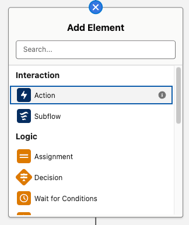
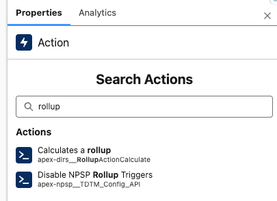
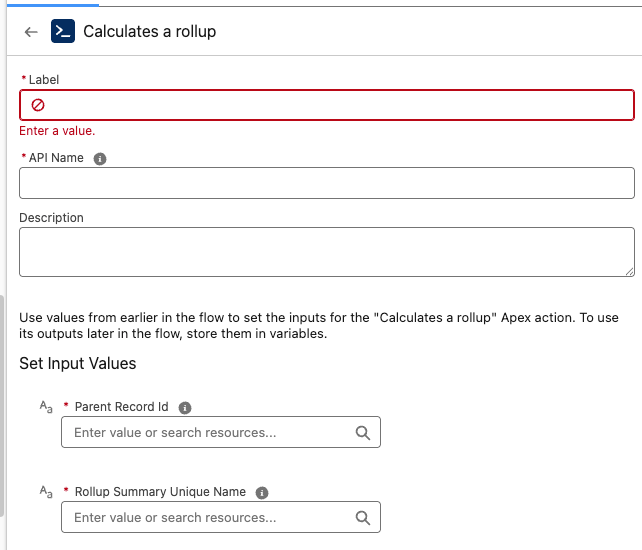

# Calling DLRS from Flow

While DLRS provides native scheduling and record-based triggers, there may be scenarios where you want more control over how and when your rollups recalculate. In these cases, calling DLRS directly from Flow can provide greater flexibility.

## Using DLRS in Flows
 

1. **Review the Rollup that will be called by the Flow:**
    * You'll need to take note of two details:
        1. The rollup's API Name
        2. The parent object being used
    * It's also important to review the rollup's Calculation Mode:
        * If the rollup should only be triggered by flow, use **Invocable by Automation**. 
        * Other Calculation Modes can be used, but keep in mind that there's an increased risk that recalculation could fail if the rollup is called multiple ways at the same time.
            * For example, if you have a rollup with the realtime calculation mode, a scheduled nightly flow would be relatively safe while a record-triggered flow would be more likely to run into issues.
          

2. **Create the Flow:**
    * DLRS can be called from any flow type that allows apex action elements.
        * For example, apex action elements can be added to after-save record-triggered flows, but not before-save.
    * In addition, your flow will need to provide DLRS with the ID or IDs of the parent object records you want to recalculate rollup values for.
        * The DLRS action accepts one parent object ID at a time, so if you have a collection of IDs, you'll need to use a loop to pass records to DLRS for recalculation.
      

3. **Add the DLRS Action:**
    * Click the icon to add a new element to the canvas, then select the Action option. 

    - Search for the action labeled "Calculates a rollup": 
    - Configure the action by entering the two required Input Values:
        1. **Parent Record ID**: Supply a record ID variable (make sure this is using the same parent object as the rollup).
        2. **Rollup Summary Unique Name**: Paste the Lookup Rollup Summary API Name of the rollup that should be recalculated for the supplied parent record. 

4. Test your flow
- When debugging the flow, you'll be able to see whether the "Calculates a rollup" action successully completed.
- However, the debug panel won't show what updates were made to record fields by any called DLRS rollups. We recommend testing with an active flow in a sandbox environment in order to confirm you're seeing the expected updates to your rollup's target fields.

## Use Cases

### More Efficient Date-based Recalculation
Standard DLRS triggers only fire when a child record is edited or deleted. If you have rollups with time-based criteria, you may need to recalculate them at specific times even though the child records haven't been changed. One option to handle this is to schedule a full recalculation job, but another is to use a scheduled flow. This can allow you to recalculate just the records that need updates rather than running the rollup for every parent record in your system.
- Example: A rollup counting "Active Memberships" where membership expires based on a date. The rollup won't update automatically when that date passes.
- Solution: A nightly Scheduled Flow that finds parent records with expiring memberships and triggers DLRS recalculation.

### Trigger from Formula Field Changes
DLRS doesn’t trigger from changes to a formula field. Record-triggered flows also can't trigger directly from formula fields, but they can run based on changes to the fields the formula is based on.
- Solution: Use a Record-Triggered Flow to reference fields that are part of the formula.

### Rollup Dependencies on Non-Child Related Objects 
You may want to trigger recalculation of a parent record rollup based on changes to records other than the child records being rolled up. Calling DLRS from Flow can allow more flexibility.
- Solution: Use a Record-Triggered Flow from a third object to call the DLRS action for parent records you want to recalculate.

 
**Special thanks to the DLRS team at the January 2026 Virtual Sprint for contributing to this page**
- Amber Crispin
- Megan Lutz
- Quratulain Tariq
- Erica Wong
- Kyle Broeckel
