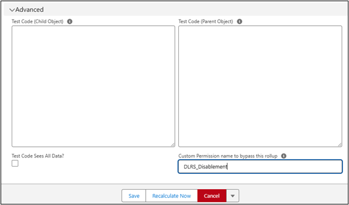

# Disable DLRS Globally using a Custom Setting
Available in version 2.23

**Note**: This setting will disable ALL existing and newly created DLRS rollups in your system. This should be used to temporarily stop the rollups in particular situations, for example data migrations or troubleshooting. 

1. Go to Set up > Custom Settings and locate the Declarative Lookup Rollup Summaries custom setting.
   
   
   
2. Click Manage. 
   1. If no records exist, click New and then Save to create the record. Once the record is saved click Edit.
   
      
       
   2. If the record already exists and the settings are visible, click Edit.

      
       
3. Check the “Disable DLRS Globally” checkbox and click Save.
   
      
      

# Disable DLRS for Individual Users
Available in version 2.23

Disable DLRS for Individual Users using a Custom Permission and field on the DLRS rollup record.

1. Create Custom Permission.
    1. Go to Set up > Custom Permissions.
    2. Click New.
    3. Enter the Custom Permission details.
        1. Label (recommendation: DLRS Disablement)
        2. Name will automatically populate
    4. Click Save.
    5. Copy the API Name of the Custom Permission. (You will need this later.)
2. Create Permission Set.
    1. Go to Set up > Permission Sets.
    2. Click New.
    3. Enter Permission Set details.
        1. Label: DLRS Disablement
        2. API Name will populate
        3. Description: Assign to individual users to allow for individual DLRS to be disabled for specific users.
    4. Click Save.
    5. Go to the Custom Permissions Section of the Permission Set.
    6. Click Edit.
    7. Move the DLRS Disablement to the “Enabled Custom Permissions.” 
    8. Click Save.
3. Assign Permission Set.
    1. At the top of the Permission Set you created, click Manage Assignments button.
    2. Click Add Assignment.
    3. Search for and Select the user you would like to disable DLRS rollups for.
    4. Click Next.
    5. Enter expiration date, if applicable.
    6. Click Assign.
    7. Copy the API Name of the Permission Set.
4. Update Rollup record.
    1. On the Manage Lookup Rollup Summaries tab.
    2. Click Try Our New Wizard (to access the new DLRS layouts).
    3. Select the Rollup that you want to Disable for anyone with the Permission Set.
    4. Click the Advanced header to open the Advanced section.
    5. Paste the API name of the Permission Set in the “Custom Permission name to bypass this rollup.”
       
        
        
    6. Click Save.

**Note:** If you need to bypass different rollups for different sets of users, you will need to create multiple Custom Permissions and Permission Sets.  


# Disable DLRS using Apex API Method
Available in version 2.23

There is a new method that allows DLRS to be disabled in Apex.

DLRS can be disabled globally using new Apex API method: `RollupService.bypassAll()` 

If you have a custom API endpoint that you don’t want to trigger any rollups, you could add `RollupService.bypassAll();` at the top of the API, do your work and return a result to the user.

If you’re writing something like anonymous apex or have a custom @InvocableAction in a Flow, adding `RollupService.bypassAll();` to start the Apex portion is all you need to ensure no rollups are processed during that transaction.

For example, if I wanted to update a field on a Contact but suppress DLRS I would write something like this


```
`RollupService.bypassAll()` 
Contact c = new Contact(Id = '003000000000001', Custom_Field__c = 'New Value');
update c;
```


That would write the new Custom_Field__c value to the chosen contact without allowing DLRS to update any rollups.
