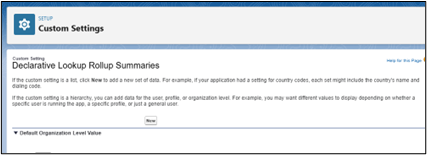

# Disable “Problem” Emails using a Custom Setting

**It is not recommended to leave this setting in place permanently.** The purpose of this setting is to provide a reprieve from the error emails to allow your organization time to troubleshoot and resolve the underlying cause of the errors without the repetitive error emails causing limit issues.

1. Go to Set up > Custom Settings and locate the Declarative Lookup Rollup Summaries custom setting.

   

2. Click Manage. 
    1. If no records exist, click New and then Save to create the record. Once the record is saved click Edit.

         

    2. If the record already exists and the settings are visible, click Edit.
  
       

4. Check the “Disable Problem Emails”checkbox and click Save.

   
   
**Note: this is not a solution to the errors, it is just a way to stop the emails, to allow time to resolve the errors.**
