# Getting Started
## Creating a New Lookup Rollup Summary

1. Open the “Manage Lookup Rollup Summaries (Beta)” from the App Launcher.

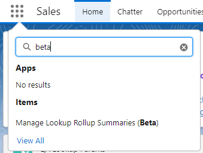

2. On this page, at the top of the list view, click the “New” button. If this is the first rollup created in the org, the "Create Rollup" modal window (Step 3) will launch when you open this page.

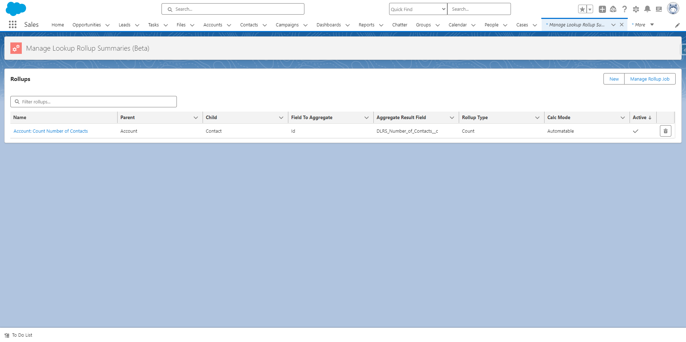

3. Fill out the following fields. While not all fields listed below are required to save a rule, all fields below are required to have a working rule.  
        - Lookup Rollup Summary Label (Lookup Rollup Summary API Name will auto-populate)  
        - Child Object  
        - Field to Aggregate  
        - Relationship Field  
        - Parent Object  
        - Aggregate Result Field  
        - Rollup Type  
        - Calculation Mode  
        - Calculation Sharing Mode  
        
Below is an example of a simple rule.  

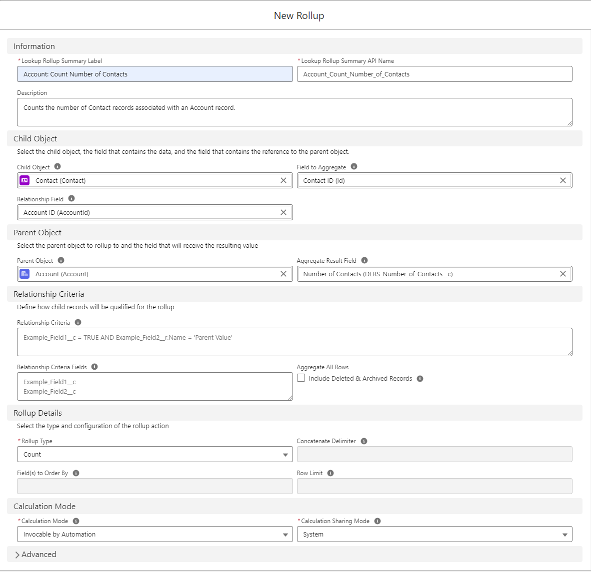

All fields, both required and optional, that appear on this page are defined in the chart below.

### Information Fields

| Name | Description |
| ------------- | ------------- |
| Lookup Rollup Summary Label | Name of your new rollup |
| Lookup Rollup Summary API Name | API Name of your new rollup. This is automatically populated from the Lookup Rollup Summary Label. |
| Description | Fill this in to help yourself and others remember what this rule is for. |

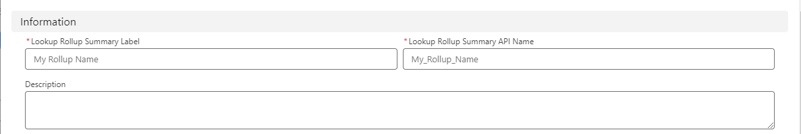

### Child Object Fields

| Name | Description |
| ------------- | ------------- |
| Child Object | Pick the child object that you want to do your rollup from. |
| Field to Agregate | The field on the child object that you will be performing a rollup on. |
| Relationship field | Lists all fields, with relationship fields listed first. You can use any field you need. |

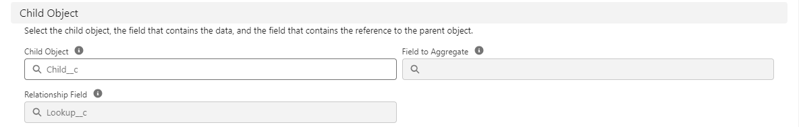

### Parent Object Fields

| Name | Description |
| ------------- | ------------- |
| Parent Object | The object that will hold the field where you roll up to. |
| Aggregate Result Field | This is the field that will hold the output of your roll up rule. |

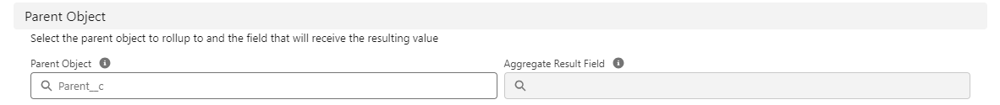

### Relationship Criteria Fields

| Name | Description |
| ------------- | ------------- |
| Relationship Criteria | If you want to filter the Child Object records enter the SOQL WHERE query here (e.g. Amount >200 AND Stage = ‘Closed Won’)  |
| Relationship Criteria Fields | Enter any field that will be used in the Criteria from above, enter one field per line e.g.  Amount  Stage  _If you are referencing RecordType.Name or RecordType.DeveloperName in your WHERE clause, exclude them from the Relationship Criteria fields as it will result in an error._ |
| Aggregate All Rows - Include Deleted & Archived Records | This setting will allow you to also rollup from Deleted & Archived records. Can be used in conjunction with a SOQL query to only count those type of records.|

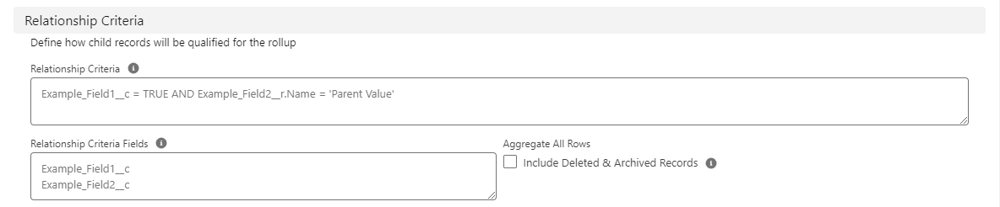

### Rollup Details Fields

| Name | Description |
| ------------- | ------------- |
| Rollup Type | The type of rollup being performed. Options are: Sum Max Min Avg Count Count Distinct Concatenate Concatenate Distinct First Last Please see: [Aggregation Operators](https://sfdo-community-sprints.github.io/DLRS-Documentation/Issues/#what-are-the-aggregation-operators) to see how each Rollup Type works  |
| Concatenate Delimiter | If using ‘Concatenate’ or ‘Concatenate Distinct’ in Aggregate Operation, the delimiter is used to separate the values e.g. , (comma) : (semi-colon) etc. |
| Field(s) to Order By | Useful if concatenating. |
| Row Limit | How many rows to include in the rollup. |

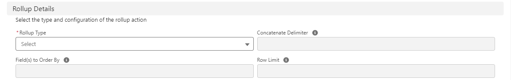

### Calculation Mode Fields

| Name | Description |
| ------------- | ------------- |
| Calculation Mode | _Please see the Scheduling and Performance issues FAQ before setting the calculation mode as using the Realtime mode can run into performance issues and Apex CPU limits._ **Watch for Changes and Process Later** - Run a full or incremental calculate on a schedule with Scheduled Apex (uses a trigger) **Realtime** - Uses the child trigger to immediately calculate rollups (uses a trigger) **Invocable by automation** - Call the DLRS Apex Action from a Flow or other automation, either as an immediate or scheduled action (does not require a trigger) **Developer** - Allows you to call DLRS from your own apex without using the DLRS trigger (does not require a trigger) |
| Calculation Sharing Mode | Determines whether Salesforce sharing configurations should be taken into account when the rollup calculates. **User** - Calculates all records visible to the user who triggered the rollup calculation.  **System** - Will calculate all records regardless of the current users access |

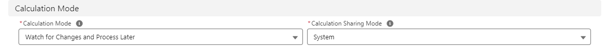

### Advanced Fields
_The fields below are used when the test code methods need to be edited for deployment or to maintain code coverage.
For more information please see [this example](https://github.com/SFDO-Community/declarative-lookup-rollup-summaries/issues/356) where these fields were needed._

| Name | Description |
| ------------- | ------------- |
| Test Code (Child Object) | Override the generated method body for the new test class used to test the DLRS trigger, useful if your child object needs values added, or other records created, to be successfully saved in Salesforce. |
| Test Code (Parent Object) | Same as above, but using Parent instead of Child |
| Test Code Sees All Data? | Checking this box tells the generated test classes that they can see your production data in the database when running tests. Not recommended but sometimes necessary. (No data will be harmed by using this setting).   For more information, [see here](https://developer.salesforce.com/docs/atlas.en-us.apexcode.meta/apexcode/apex_testing_seealldata_using.htm) |

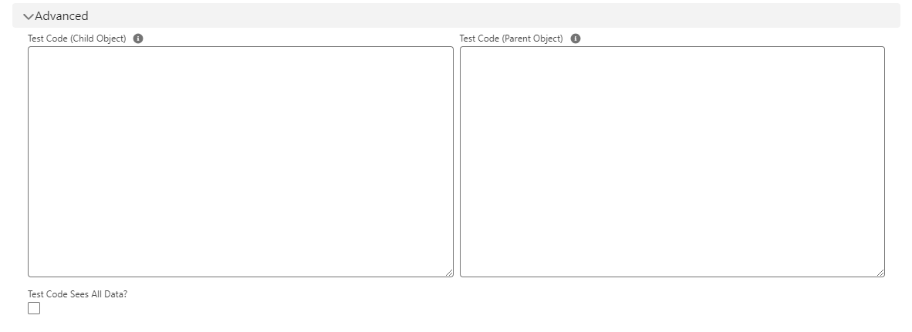

## Saving your newly created rule
Once you have filled out all fields, scroll to the bottom of the page and click “Create”.
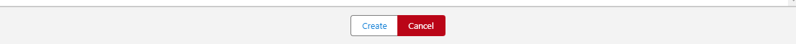

Once you have successfully created your rule, you will be greeted by similar toast messages.
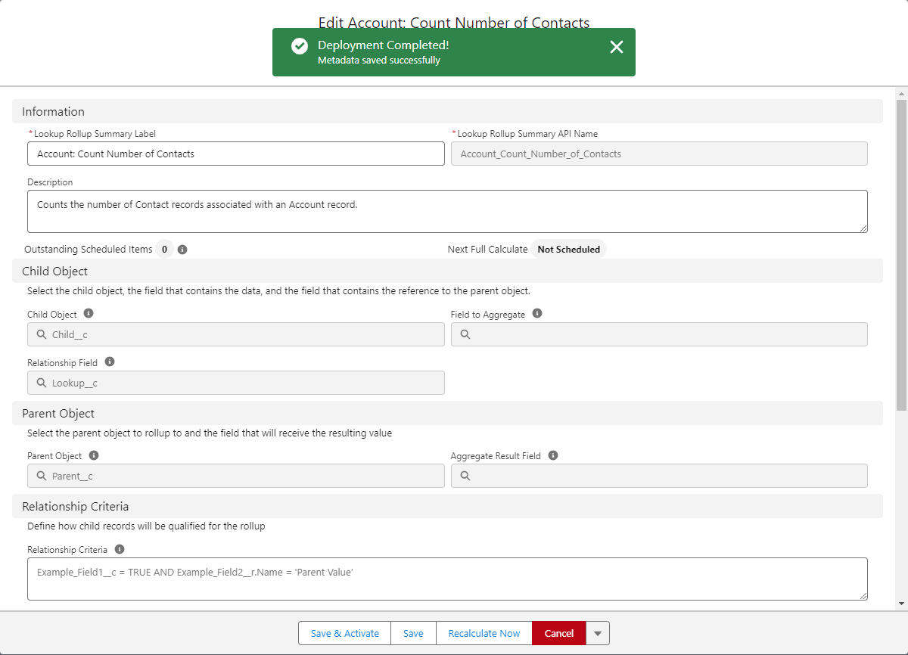

## Deploying / Scheduling your newly created rule
To deploy and/or schedule your rule, please go to the [Scheduling Rollups v2.21](https://sfdo-community-sprints.github.io/DLRS-Documentation/User%20Guide/scheduling_rollups_v2_21.md) article.
