# Getting Started using the DLRS Wizard (in versions 2.21 and later)
## Creating a New Lookup Rollup Summary

Before proceeding, be sure to create the field on the parent object to store your rollup results. This will be required when creating your rollup.

To begin creating a new rollup, open the DLRS (Declarative Lookup Rollup Summaries) App and navigate to the 'Manage Lookup Rollup Summaries (Beta)' tab.

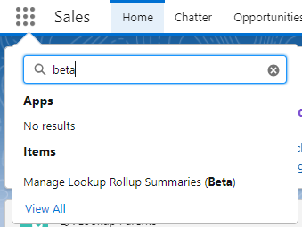

On this page, at the top of the list view, click the “New” button. Note: If this is the first rollup created in the org, the "Create Rollup" modal window (Step 3) will launch when you open this page.

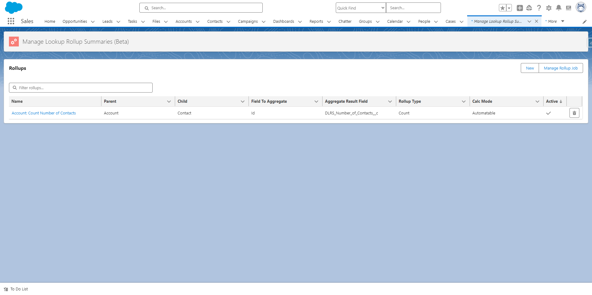

### Required fields
Fill out the following fields. While not all fields listed below are required to save a rule, all fields below are required to have a working rule.  
        - Lookup Rollup Summary Label (Lookup Rollup Summary API Name will auto-populate)  
        - Child Object  
        - Field to Aggregate  
        - Relationship Field  
        - Parent Object  
        - Aggregate Result Field (the field you created first, above  
        - Rollup Type  
        - Calculation Mode  
        - Calculation Sharing Mode  
        
Below is an example of a simple rule.  

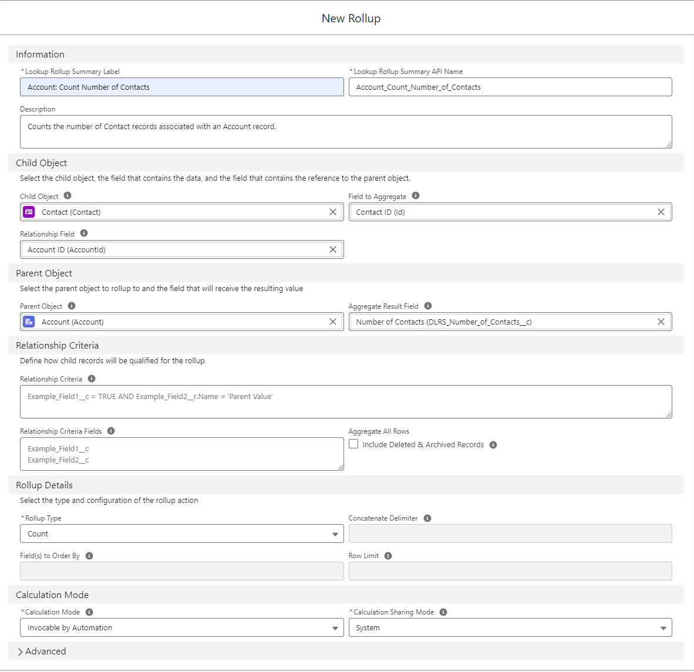

## Detailed Overview of Fields
All fields, both required and optional, that appear on this page are defined in the chart below.

### Information Fields

| Name | Description |
| ------------- | ------------- |
| Lookup Rollup Summary Label | Name of your new rollup |
| Lookup Rollup Summary API Name | API Name of your new rollup. This is automatically populated from the Lookup Rollup Summary Label. |
| Description | Brief summary of use case for rollup. |

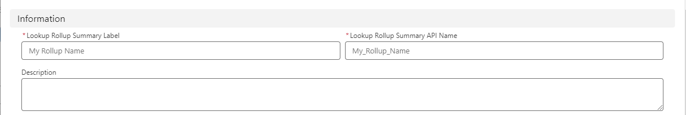

### Child Object Fields

| Name | Description |
| ------------- | ------------- |
| Child Object | The child object that you want to do your rollup from. |
| Field to Aggregate | The field on the child object that you will be performing a rollup on. |
| Relationship Field | This is the field that holds the ID or relationship from the child to the parent. |

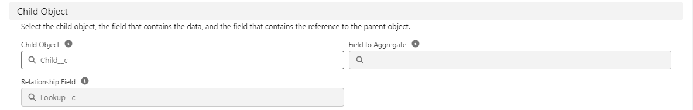

### Parent Object Fields

| Name | Description |
| ------------- | ------------- |
| Parent Object | The object that will hold the field where you roll up to. |
| Aggregate Result Field | This is the field that will hold the output of your roll up rule. |

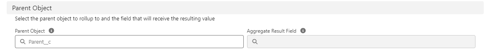

### Relationship Criteria Fields

| Name | Description |
| ------------- | ------------- |
| Relationship Criteria | If you want to filter the Child Object records enter the SOQL WHERE query here (e.g. Amount >200 AND Stage = ‘Closed Won’)  |
| Relationship Criteria Fields | Enter any field that will be used in the Criteria from above, enter one field per line e.g.  Amount  Stage  _If you are referencing RecordType.Name or RecordType.DeveloperName in your WHERE clause, exclude them from the Relationship Criteria fields as it will result in an error._ |
| Aggregate All Rows - Include Deleted & Archived Records | This setting will allow you to also rollup from Deleted & Archived records. Can be used in conjunction with a SOQL query to only count those type of records.|

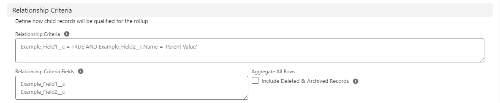

### Rollup Details Fields

| Name | Description |
| ------------- | ------------- |
| Rollup Type | The type of rollup being performed. Options are:   **Sum** - Calculates the sum of your Field to Aggregate from all of the child records returned. Only works on numeric based fields.   **Max** - Selects only the highest value of the Field to Aggregate from all of the child records returned. Only works on numeric based fields.   **Min** - Selects only the lowest value of the Field to Aggregate from all of the child records returned. Only works on numeric based fields.   **Avg** - Calculates the MEAN of the Field to Aggregate from all of the child records it finds. Only works on numeric based fields.   **Count** - Counts total rows/amount of child records returned. Note: when using Count, it is normally best to use the ID field as your Field To Aggregate.   **Count Distinct** - Calculates DISTINCT count of the values in your Field to Aggregate. Example: if the returned values are (A, A, A, B, C) in a count it would be 5 but in a count distinct it would only return 3 as there are only 3 distinct values (A, B, C).   **Concatenate** - Collects values in your Field to Aggregate and places them consecutively into the Aggregate Result Field. Only works on text fields. Example: if the returned values from the Field to Aggregate are (Apple, Apple, Apple, Orange), Concatenate will return "AppleAppleAppleOrange". To instruct DLRS on how to split up the values (comma, dash, semicolon), use the Concatenate Delimiter section below.   **Concatenate Distinct** - Collects values in your Field to Aggregate and places only the DISTINCT values consecutively into the Aggregate Result Field. Only works on text fields. Example: if the returned values from the Field to Aggregate are (Apple, Apple, Apple, Orange), Concatenate Distinct will return "AppleOrange". To instruct DLRS on how to split up the values (comma, dash, semicolon), use the Concatenate Delimiter section below.   **First** - Selects the FIRST record from all the child records returned, based on how the results are sorted, then uses the Field to Aggregate from that record. Works with any type of field. Note: use Field(s) to Order By to instruct DLRS on how to sort results.   **Last** - Selects the LAST record from all the child records returned, based on how the results are sorted, then uses the Field to Aggregate from that record. Works with any type of field. Note: use Field(s) to Order By to instruct DLRS on how to sort results. |
| Concatenate Delimiter | If using 'Concatenate' or 'Concatenate Distinct' in Aggregate Operation, the delimiter is used to separate the values. Multiple delimiters can be used in combination. Common options are:  **,** (comma) - A standard delimiter for separating values in a text list.  **;** (semi-colon) - Another common delimiter, often used for multi-picklist fields or when you want to differentiate values visually.  **SP()** (space) - You can use this to add a space between concatenated values. Note: using SP() is the only way to insert whitespace on concatenated text fields. Example: Concatenating the values (Apple, Apple, Apple, Orange) with the delimiter ";" will return "Apple;Apple;Apple;Orange". Using the delimiter ";SP()" will return "Apple; Apple; Apple; Orange". Can be used in both long text and rich text fields.  **TB()** (tab) - Inserts a tab character between values. Can be used in both long text and rich text fields.  **BR()** (line break) - Inserts a new line between each concatenated value, useful for displaying values in a multi-line format. Can only be used in a long text field and cannot be used in a rich text field (use &lt;br&gt;).  **&lt;br&gt;** (line break tag) - An HTML line break tag. Note: using &lt;br&gt; is the only way to insert a line break in a rich text field.  **&lt;p&gt;** (paragraph tag) - An HTML paragraph tag. Note: using &lt;p&gt; is the only way to insert a paragraph break in a rich text field. |
| Field(s) to Order By | Useful if concatenating. |
| Row Limit | How many rows to include in the rollup. Only applies when using the Last or Concatenate Distinct operators. |

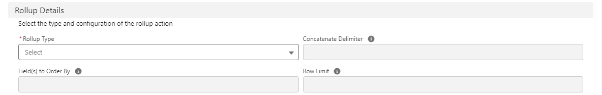

### Calculation Mode Fields

| Name | Description |
| ------------- | ------------- |
| Calculation Mode | _Please see the Scheduling and Performance issues FAQ before setting the calculation mode as using the Realtime mode can run into performance issues and Apex CPU limits._ **Watch for Changes and Process Later** - Run a full or incremental calculate on a schedule with Scheduled Apex (uses a trigger) **Realtime** - Uses the child trigger to immediately calculate rollups (uses a trigger) **Invocable by automation** - Call the DLRS Apex Action from a Flow or other automation, either as an immediate or scheduled action (does not require a trigger) **Developer** - Allows you to call DLRS from your own apex without using the DLRS trigger (does not require a trigger) |
| Calculation Sharing Mode | Determines whether Salesforce sharing configurations should be taken into account when the rollup calculates. **User** - Calculates all records visible to the user who triggered the rollup calculation.  **System** - Will calculate all records regardless of the current users access |

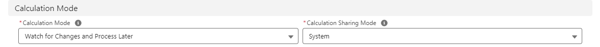

### Advanced Fields
_The fields below are used when the test code methods need to be edited for deployment or to maintain code coverage.
For more information please see [this example](https://github.com/SFDO-Community/declarative-lookup-rollup-summaries/issues/356) where these fields were needed._

| Name | Description |
| ------------- | ------------- |
| Test Code (Child Object) | Override the generated method body for the new test class used to test the DLRS trigger, useful if your child object needs values added, or other records created, to be successfully saved in Salesforce. |
| Test Code (Parent Object) | Same as above, but using Parent instead of Child |
| Test Code Sees All Data? | Checking this box tells the generated test classes that they can see your production data in the database when running tests. Not recommended but sometimes necessary. (No data will be harmed by using this setting).   For more information, [see here](https://developer.salesforce.com/docs/atlas.en-us.apexcode.meta/apexcode/apex_testing_seealldata_using.htm) |

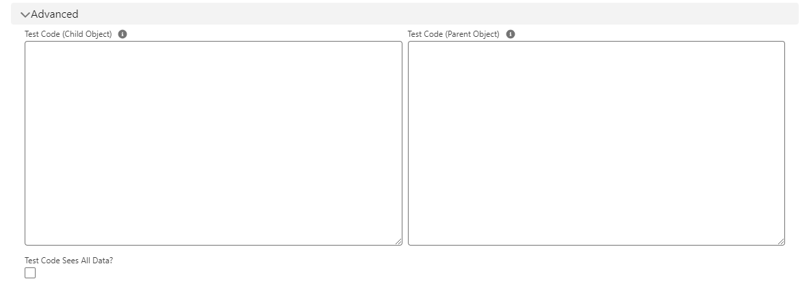

## Saving your newly created rule
Once you have filled out all fields, scroll to the bottom of the page and click “Create”.
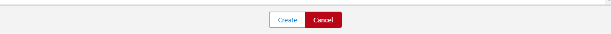

Once you have successfully created your rule, you should receive a success message, similar to the one below.
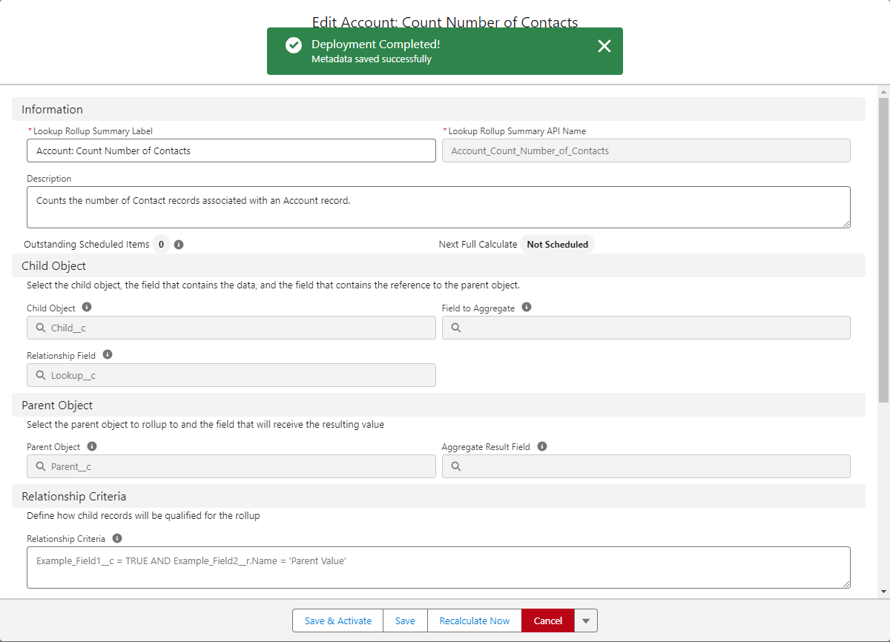

## Deploying / Scheduling your newly created rule
To deploy and/or schedule your rule, please go to the [Scheduling Rollups v2.21](https://sfdo-community-sprints.github.io/DLRS-Documentation/User%20Guide/scheduling_rollups_v2_21.html) article.

**Special thanks to the DLRS team at the January 2026 Virtual Sprint for contributing to this page**
Kyle Sebastian
Quratulain Tariq
Aaron Crosman
Erica Wong
Amber Crispin
Megan Lutz
Caitlyn Duer 
Shari Carlson
Kyle Broeckel

