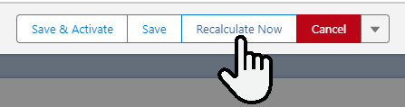
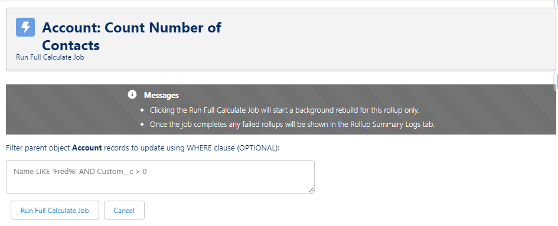
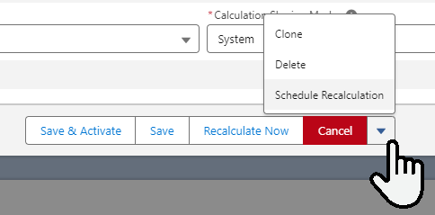
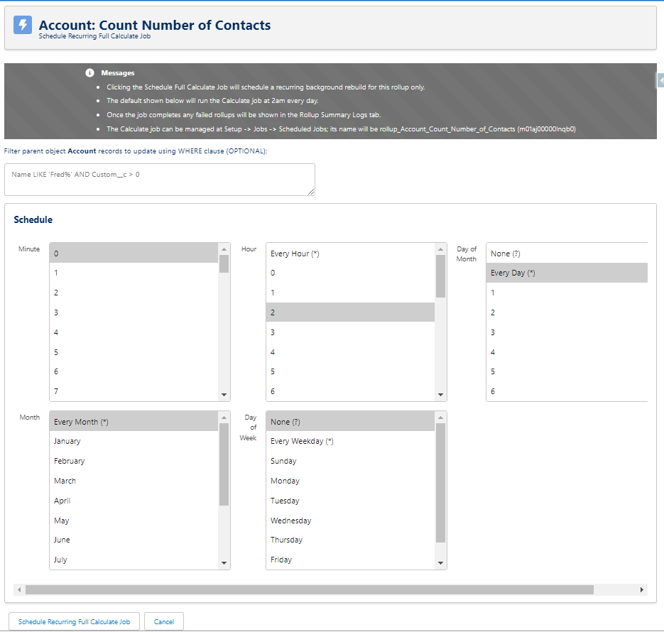
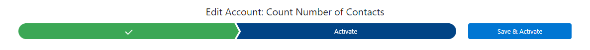
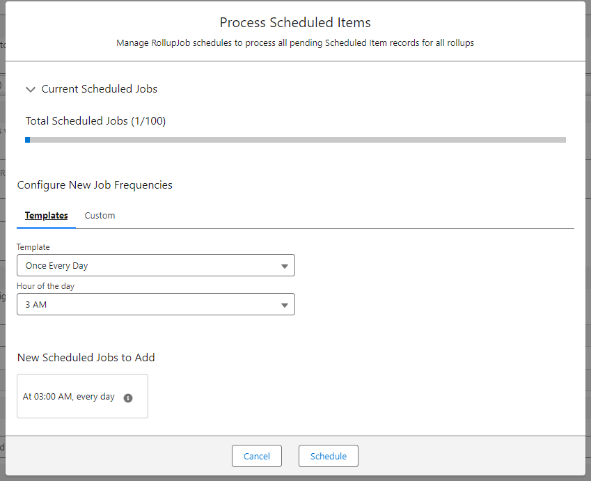
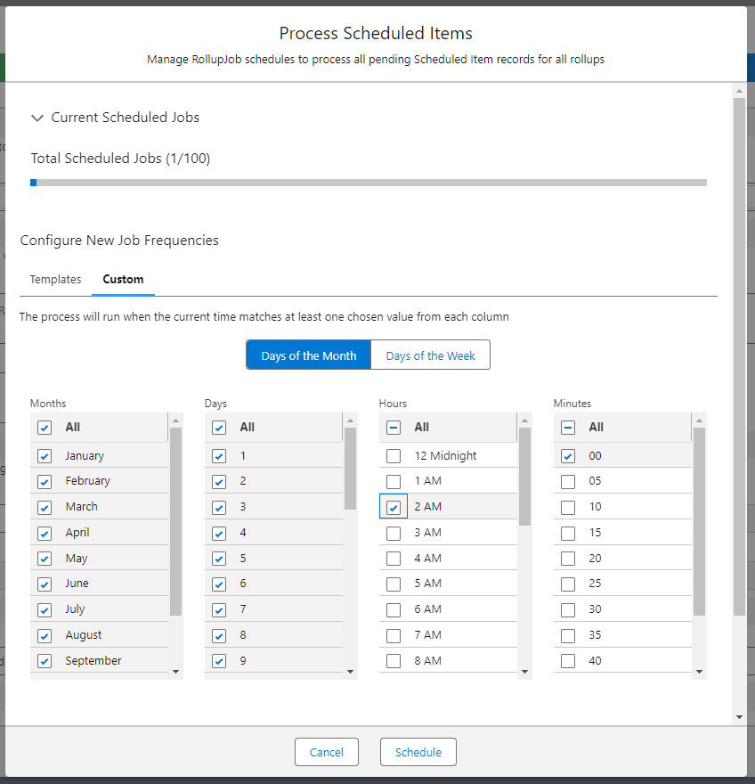
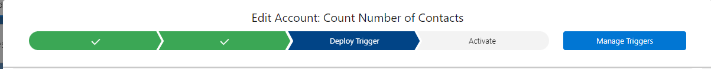
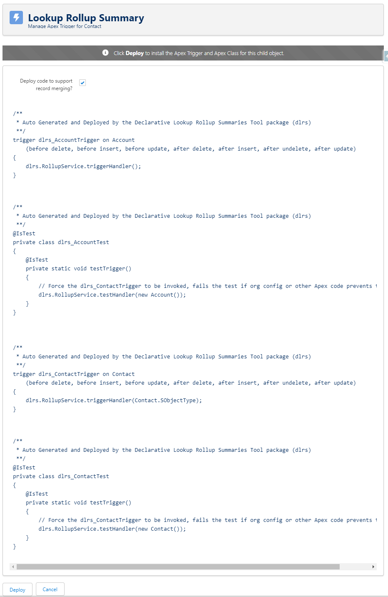
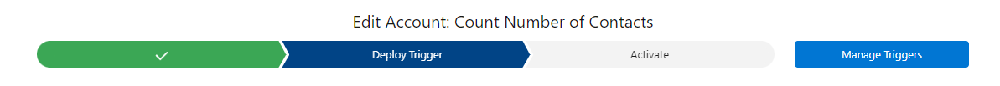

# Deploying and Scheduling Rollups (for version 2.21)
Once your rule is created and saved, you have several options.

## Full Calculation - Recalcuate Now or Schedule Recalculation
_Both of these buttons work in all Calculation Modes (with the exception of "Realtime"), even if the rule is not active. To use either of these buttons with the "Realtime" Calculation Mode, the rule must already be activated._

**Recalculate Now** - If you click this button, you will be able to run either a full recalculation or filter parent records to calculate upon using a SOQL query.

The example below shows a full recalculation job (i.e. the query has not been filtered using SOQL)

_(The "Name LIKE 'Fred%' AND Custom__c > 0" query is example text to give you an idea of how your query should look. You do not need to worry about it. It's presence will not effect a full calculate job, and it will clear out the moment you start to  type in your own query.)_

**Schedule Recalculation** - Choosing this option will take you to a page that will allow you to schedule full recalculations and also to filter the parent records for which recalculation will happen upon using a SOQL query.

The example below shows a full recalculation job that would be scheduled for 2 AM every day.

# Deploying Rules
Depending on what Calculation Mode you have you chosen, the process to deploy your rule will vary slightly. Please locate your chosen Calculation Mode below.

## A Note On Triggers
While the **Developer** and **Invocable by Automation** calculation modes can be called by flows or Apex code, or scheduled using the instructions above, the other Calculation Modes do require a child trigger.

The **Watch for Changes and Process Later** Calculation Mode rollups will not run every time a child is created but will be processed in bulk when Apex is scheduled. A trigger installed by DLRS makes note of each child record that gets changed and stores it in a Lookup Rollup Summary Schedule Items object record. Then whenever the Apex Class “RollupJob” runs all of those items are taken care of and then the Lookup Rollup Summary Schedule Items record is deleted.

The **Realtime** Calculation Mode requires the deployment of a child trigger to run your rollup whenever a child record is saved.

## Developer / Invocable by Automation Calculation Modes 
Simply choose "Save and Activate" in the path. Your rule is now ready to be called by a flow or Apex code, or to be scheduled using the instructions above.

## Watch for Changes and Process Later Calculation Mode
Please choose "Schedule Job" on the path at the top of the window.  

You can use the Process Scheduled Items wizard in the modal window to either choose a pre-designed template or create a custom schedule. You can also view currently scheduled jobs for all Process Scheduled Items rollups from this window. 

The example below shows a template schedule job that would be scheduled for 3 AM every day.

The example below shows a custom schedule job that would be scheduled for 2 AM every day.

Once you have set a schedule, please choose "Deploy Trigger" on the path at the top of the window.  

This will take you to the Manage Apex Trigger page. Scroll to the bottom of the page and click "Deploy".

Once you have deployed the trigger, please choose "Activate" on the path at the top of the window. This will activate the rollup rule. Your rule will now log records as they change, and process those changes at the next interval you specified in the schedule you defined.

## Realtime Calculation Mode
Please choose "Deploy Trigger" on the path at the top of the window. 

This will take you to the Manage Apex Trigger page. Scroll to the bottom of the page and click "Deploy".

Once you have deployed the trigger, please choose "Activate" on the path at the top of the window. This will activate the rollup rule. Rollups will be updated in realtime as records are created or updated.

