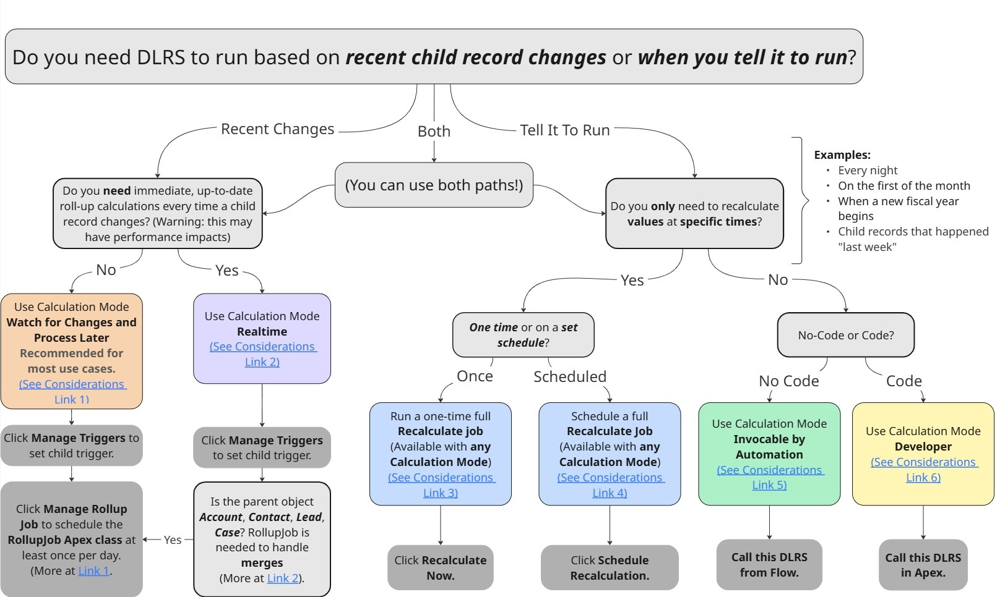

[Join the DLRS Trailblazer Community - Today!](https://trailhead.salesforce.com/trailblazer-community/groups/0F9300000009O5pCAE){: .btn .btn-green }

# What is Declarative Lookup Rollup Summaries?

DLRS is a mechanism for aggregating or summarizing data from child objects and displaying it on a parent object. It serves the same purpose as Rollup Summary fields, but it is much more flexible with the kind of data that can be rolled up and how criteria are formed.

- **Declarative**: "clicks not code"
- **Lookup**: relationship between a “parent” record and “child” record that does not have to be master-detail
- **Rollup**: collecting the data from child records and doing calculations
- **Summaries**: the result of the calculations displayed on the parent records

## What Business Problems Does DLRS Solve?
Declarative Lookup Rollup Summaries allow a much greater range of rollup summary options than exist in the standard “Rollup Summary Fields” (RSFs) or, if you use NPSP, in Customizable Rollups. The business problem solved here is generally the ability to create a key metric or “summary” of a calculated value on a field in your Salesforce instance.

Where RSF’s require you to have a Master-Detail (Parent-Child) relationship, DLRS can be used to rollup data between any two objects with a linking record ID. Have a look at the [‘Cookbook’](https://sfdo-community-sprints.github.io/DLRS-Documentation/Cookbook/) for examples of rollups.

Unlike RSFs, there is no limitation on the amount of rollups that Salesforce permits you to create. You can create as many of them as needed.
Additionally, the metrics available with RSFs, are limited to sum, minimum value, or maximum value as a calculated metric. There are extended “operations” that can be performed with DLRS such as:
* Average, 
* Count Distinct, 
* Concatenate, and
* First and Last.

## When to set DLRS to run and How

Links for this image:
- [Link 1](https://sfdo-community-sprints.github.io/DLRS-Documentation/User%20Guide/scheduling_rollups_v2_21.html#watch-for-changes-and-process-later-calculation-mode)
- [Link 2](https://sfdo-community-sprints.github.io/DLRS-Documentation/User%20Guide/Merging.html)
- [Considerations Link 1](https://sfdo-community-sprints.github.io/DLRS-Documentation/Architecture/calculates.html#considerations-for-realtime)
- [Considerations Link 2](https://sfdo-community-sprints.github.io/DLRS-Documentation/Architecture/calculates.html#considerations-for-recalculate-nowschedule-recalculation)
- [Considerations Link 3](https://sfdo-community-sprints.github.io/DLRS-Documentation/Architecture/calculates.html#considerations-for-recalculate-nowschedule-recalculation)
- [Considerations Link 4](https://sfdo-community-sprints.github.io/DLRS-Documentation/Architecture/calculates.html#considerations-for-invocable-by-automation)
- [Considerations Link 5](https://sfdo-community-sprints.github.io/DLRS-Documentation/Architecture/calculates.html#considerations-for-developer)

## Features Summary

- Rollup information between Lookup relationships not previously possible without writing Apex Triggers
- Define rollups using standard UI declaratively, no coding required
- Define filter criteria on rollups for example Rollup Amount on Opportunity onto Account for Closed Won
- Supports Realtime, Scheduled and Developer API modes
- Open source, available in code and managed package form.
- Managed package has passed Salesforce Security Review and is Aloha enabled (which means the package does not count against limits in the Salesforce org, such as number of custom objects) 
- Supports Custom Metadata, rollups can be included in Change Sets and Packages for easier deployment

## How and When DLRS Calculates

[Understanding when DLRS Calculates](https://sfdo-community-sprints.github.io/DLRS-Documentation/Architecture/calculates.html)
- Realtime trigger - Set Rollup to `Realtime` Calculation Mode.
- Async trigger based calculations - Set Rollup to `Watch for Changes and Process Later` (`Scheduled` in version prior to 2.21) Calculation Mode.
- Trigger from declarative automation - `Invocable by Automation` (`Process Builder` in versions prior to 2.21) - This is also what allows DLRS to run in Professional Edition. [Info](https://sfdo-community-sprints.github.io/DLRS-Documentation/Installation/configuration.html)
- Full calculations - There are buttons at the bottom of the rollup to manually recalculate (`Recalculate Now`) or schedule a full recalculation (`Schedule Recalculation`).

## DLRS History 
[Learn about the DLRS journey through past community posts.](https://sfdo-community-sprints.github.io/DLRS-Documentation/About%20Us%20&%20Contribution/dlrsHistory.html)

